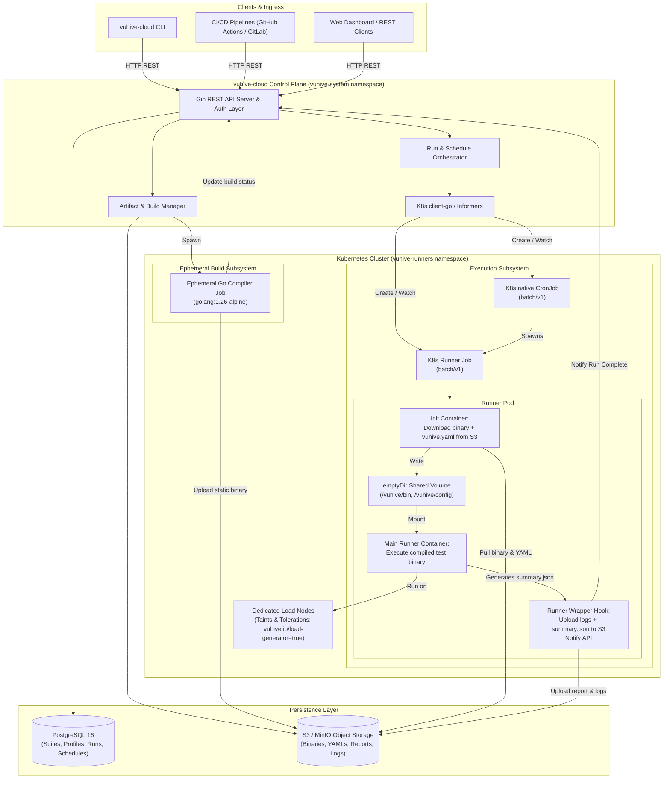

# vuhive-cloud: Architecture & Implementation Specification

**Project:** `vuhive-cloud`  
**Repository:** `github.com/morphy76/vuhive-cloud`  
**Target Core Dependency:** `github.com/morphy76/vuhive`  
**Language & Runtime:** Go 1.26+  
**Target Platform:** Kubernetes (1.28+)  

---

## 1. Executive Summary & Vision

`vuhive-cloud` is a cloud-native control plane for orchestrating distributed and scheduled load testing workloads powered by `vuhive`. Because `vuhive` test scenarios are written and compiled natively in Go (yielding zero-allocation hot paths and microsecond precision), `vuhive-cloud` bridges the gap between Go source code and Kubernetes execution:

- **Source-to-Binary Registry:** Accepts Go test sources, compiles them via isolated, ephemeral Kubernetes Build Jobs into static multi-arch binaries (`linux/amd64`, `linux/arm64`), registers artifacts, and stores them in S3-compatible object storage.
- **Config & Suite Management:** Maintains a registry of compiled test suites paired with reusable or attached `vuhive.yaml` configurations and compute Runner Profiles.
- **Orchestration:** Dispatches single-pod (Milestone 1) and distributed multi-pod (Milestone 2) test executions via Kubernetes `batch/v1` `Job`s and native `CronJob`s, honoring dedicated node affinities, taints, tolerations, and resource quotas.
- **Reporting & Telemetry:** Ingests deterministic `summary.json` reports and execution logs into S3, while indexing core performance indicators (SLA compliance, p50/p90/p95/p99 latency, throughput TPS, error rates) in PostgreSQL for historical comparisons and analytics.

---

## 2. System Architecture & Topology



---

## 3. Hexagonal Architecture & Package Layout

Adhering strictly to Clean Hexagonal Architecture and DDD boundaries:

```text
vuhive-cloud/
├── cmd/
│   ├── server/              # Control plane API server entrypoint
│   └── runner-wrapper/      # Lightweight sidecar/wrapper binary injected into runners
├── internal/
│   ├── domain/              # Pure business models & logic (No external framework imports)
│   │   ├── model/
│   │   │   ├── suite.go         # TestSuite aggregate
│   │   │   ├── artifact.go      # Binary artifact entity & platform VO
│   │   │   ├── profile.go       # RunnerProfile (Affinity, Tolerations, Resources)
│   │   │   ├── run.go           # TestRun aggregate, states, SLA results
│   │   │   ├── schedule.go      # TestSchedule aggregate (Cron spec)
│   │   │   └── errors.go        # Domain error definitions
│   │   └── event/
│   │       └── events.go        # Domain events (RunStarted, RunCompleted, BuildFailed)
│   ├── application/         # Use Case Orchestration Layer
│   │   ├── ports/
│   │   │   ├── inbound/     # Driving interfaces (SuitesUseCase, RunsUseCase, SchedulesUseCase)
│   │   │   └── outbound/    # Driven interfaces (Repositories, K8sOrchestrator, StoragePort)
│   │   └── service/         # Use case implementations
│   │       ├── suite_service.go
│   │       ├── run_service.go
│   │       ├── schedule_service.go
│   │       └── build_service.go
│   └── adapters/            # Infrastructure & I/O Adapters Layer
│       ├── inbound/
│       │   └── http/        # Gin REST handlers, DTOs, Auth middleware
│       │       ├── router.go
│       │       ├── suite_handler.go
│       │       ├── run_handler.go
│       │       └── schedule_handler.go
│       └── outbound/
│           ├── postgres/    # pgx / sqlx repositories for PostgreSQL
│           ├── s3/          # MinIO / AWS S3 client adapter
│           └── k8s/         # client-go orchestrator (Job & CronJob builders, Informers)
```

---

## 4. Detailed Workflows

### 4.1 Source-to-Binary Build Workflow
1. **Upload:** User/CI posts a tarball/zip of Go source code (or Git reference) and target architecture (`linux/amd64` or `linux/arm64`) to `POST /api/v1/suites/{id}/builds`.
2. **Staging:** Control plane saves the source archive to S3 bucket `vuhive-sources/{suite_id}/{build_id}.tar.gz`.
3. **Build Job:** Control plane dispatches an ephemeral Kubernetes Job (`vuhive-build-{build_id}`) in `vuhive-system` using image `golang:1.26-alpine`.
4. **Compilation:** The build pod downloads sources, executes:
   ```bash
   CGO_ENABLED=0 GOOS=linux GOARCH=${TARGET_ARCH} go build -trimpath -ldflags="-s -w" -o /workspace/runner .
   ```
5. **Publish:** The build pod uploads the static binary to `s3://vuhive-binaries/{suite_id}/{build_id}/{target_arch}/runner` and notifies the control plane API.
6. **Ready State:** Build status transitions to `READY`. The artifact is registered with hash, size, target platform, and created timestamp.

### 4.2 Runner Execution Workflow (Ad-Hoc Run)
1. **Trigger:** User issues `POST /api/v1/runs` selecting a `suite_id`, `build_id`, optional `config_id` (vuhive.yaml), and a `runner_profile_id`.
2. **K8s Job Creation:** Control plane resolves the runner profile (tolerations, affinity, CPU/RAM) and manifests a Kubernetes `batch/v1` `Job` with labels:
   - `vuhive.io/run-id: <uuid>`
   - `vuhive.io/suite-id: <uuid>`
3. **Init Container Execution:**
   - Pod starts with init container `vuhive-cloud/runner-init:latest`.
   - Fetches the compiled binary and selected `vuhive.yaml` from S3 into `/shared`.
   - Makes `/shared/runner` executable (`chmod +x`).
4. **Runner Execution:**
   - Main container (generic runner or user-supplied custom image) mounts `/shared`.
   - Runs `/shared/runner --summary-export=/shared/summary.json` with execution output piped to `/shared/run.log`.
5. **Post-Run Hook & Report Ingestion:**
   - Injected wrapper / post-execution step uploads `/shared/summary.json` and `/shared/run.log` to S3:
     - `s3://vuhive-reports/{run_id}/summary.json`
     - `s3://vuhive-reports/{run_id}/run.log`
   - Wrapper posts completion to `POST /api/v1/runs/{id}/complete`.
   - Control plane parses `summary.json`, extracts SLA passed/failed flag, latency percentiles (`p50`, `p90`, `p95`, `p99`), total iterations, throughput TPS, and updates the `test_runs` record in PostgreSQL.

### 4.3 Native K8s CronJob Workflow (Scheduled Runs)
1. **Creation:** User issues `POST /api/v1/schedules` specifying cron expression (e.g. `0 2 * * *`), `suite_id`, `build_id`, `config_id`, and `runner_profile_id`.
2. **CronJob Manifest:** Control plane creates a `batch/v1` `CronJob` named `vuhive-sched-<schedule-id>` in the runner namespace.
3. **Execution & Discovery:**
   - When the schedule fires, K8s creates a `Job` containing template labels referencing `schedule-id`.
   - A K8s Informer in `vuhive-cloud` detects the newly spawned Job, creates a corresponding `TestRun` record linked to the schedule, and begins tracking its lifecycle identically to an ad-hoc run.

---

## 5. PostgreSQL Database Schema (DDL)

```sql
-- Test Suites
CREATE TABLE test_suites (
    id UUID PRIMARY KEY DEFAULT gen_random_uuid(),
    name VARCHAR(128) NOT NULL UNIQUE,
    description TEXT,
    created_at TIMESTAMPTZ NOT NULL DEFAULT NOW(),
    updated_at TIMESTAMPTZ NOT NULL DEFAULT NOW()
);

-- Compiled Artifacts Registry
CREATE TABLE artifacts (
    id UUID PRIMARY KEY DEFAULT gen_random_uuid(),
    suite_id UUID NOT NULL REFERENCES test_suites(id) ON DELETE CASCADE,
    platform VARCHAR(32) NOT NULL, -- e.g. 'linux/amd64', 'linux/arm64'
    s3_binary_key VARCHAR(512) NOT NULL,
    sha256_checksum VARCHAR(64) NOT NULL,
    build_logs_s3_key VARCHAR(512),
    status VARCHAR(32) NOT NULL DEFAULT 'PENDING', -- PENDING, BUILDING, READY, FAILED
    error_message TEXT,
    created_at TIMESTAMPTZ NOT NULL DEFAULT NOW()
);

-- Attached Configurations (vuhive.yaml files)
CREATE TABLE configurations (
    id UUID PRIMARY KEY DEFAULT gen_random_uuid(),
    suite_id UUID NOT NULL REFERENCES test_suites(id) ON DELETE CASCADE,
    name VARCHAR(128) NOT NULL,
    content_yaml TEXT NOT NULL,
    s3_config_key VARCHAR(512) NOT NULL,
    is_default BOOLEAN NOT NULL DEFAULT FALSE,
    created_at TIMESTAMPTZ NOT NULL DEFAULT NOW(),
    CONSTRAINT uq_suite_config_name UNIQUE(suite_id, name)
);

-- Reusable Runner Profiles (Node Affinity, Tolerations, Resources)
CREATE TABLE runner_profiles (
    id UUID PRIMARY KEY DEFAULT gen_random_uuid(),
    name VARCHAR(128) NOT NULL UNIQUE,
    description TEXT,
    runner_image VARCHAR(256) NOT NULL DEFAULT 'alpine:3.20',
    cpu_request VARCHAR(32) NOT NULL DEFAULT '1000m',
    cpu_limit VARCHAR(32) NOT NULL DEFAULT '2000m',
    memory_request VARCHAR(32) NOT NULL DEFAULT '1Gi',
    memory_limit VARCHAR(32) NOT NULL DEFAULT '2Gi',
    node_selector JSONB NOT NULL DEFAULT '{}'::jsonb,
    affinity JSONB NOT NULL DEFAULT '{}'::jsonb,
    tolerations JSONB NOT NULL DEFAULT '[]'::jsonb,
    created_at TIMESTAMPTZ NOT NULL DEFAULT NOW(),
    updated_at TIMESTAMPTZ NOT NULL DEFAULT NOW()
);

-- Schedules (Native K8s CronJob representations)
CREATE TABLE schedules (
    id UUID PRIMARY KEY DEFAULT gen_random_uuid(),
    suite_id UUID NOT NULL REFERENCES test_suites(id) ON DELETE CASCADE,
    artifact_id UUID NOT NULL REFERENCES artifacts(id) ON DELETE RESTRICT,
    configuration_id UUID REFERENCES configurations(id) ON DELETE SET NULL,
    runner_profile_id UUID NOT NULL REFERENCES runner_profiles(id) ON DELETE RESTRICT,
    name VARCHAR(128) NOT NULL,
    cron_expression VARCHAR(64) NOT NULL,
    k8s_cronjob_name VARCHAR(128) NOT NULL UNIQUE,
    is_active BOOLEAN NOT NULL DEFAULT TRUE,
    created_at TIMESTAMPTZ NOT NULL DEFAULT NOW(),
    updated_at TIMESTAMPTZ NOT NULL DEFAULT NOW()
);

-- Test Execution Runs
CREATE TABLE test_runs (
    id UUID PRIMARY KEY DEFAULT gen_random_uuid(),
    suite_id UUID NOT NULL REFERENCES test_suites(id) ON DELETE CASCADE,
    artifact_id UUID NOT NULL REFERENCES artifacts(id) ON DELETE RESTRICT,
    configuration_id UUID REFERENCES configurations(id) ON DELETE SET NULL,
    runner_profile_id UUID NOT NULL REFERENCES runner_profiles(id) ON DELETE RESTRICT,
    schedule_id UUID REFERENCES schedules(id) ON DELETE SET NULL,
    status VARCHAR(32) NOT NULL DEFAULT 'QUEUED', -- QUEUED, RUNNING, COMPLETED, FAILED, ABORTED
    k8s_job_name VARCHAR(128),
    k8s_namespace VARCHAR(64) NOT NULL DEFAULT 'vuhive-runners',
    started_at TIMESTAMPTZ,
    finished_at TIMESTAMPTZ,
    exit_code INT,
    sla_passed BOOLEAN,
    -- Indexed Summary Metrics
    total_iterations BIGINT,
    total_requests BIGINT,
    avg_tps NUMERIC(10, 2),
    p50_duration_ms NUMERIC(10, 2),
    p90_duration_ms NUMERIC(10, 2),
    p95_duration_ms NUMERIC(10, 2),
    p99_duration_ms NUMERIC(10, 2),
    error_rate_pct NUMERIC(6, 3),
    -- S3 Storage references
    s3_report_key VARCHAR(512),
    s3_logs_key VARCHAR(512),
    summary_json JSONB,
    created_at TIMESTAMPTZ NOT NULL DEFAULT NOW()
);

CREATE INDEX idx_test_runs_suite_id ON test_runs(suite_id);
CREATE INDEX idx_test_runs_status ON test_runs(status);
CREATE INDEX idx_test_runs_created_at ON test_runs(created_at DESC);
```

---

## 6. REST API Specification

All endpoints require Header `Authorization: Bearer <token>` or `X-API-Key: <key>`.

| Method | Path | Description |
|---|---|---|
| `GET` | `/api/v1/health` | Service liveness/readiness probe |
| `POST` | `/api/v1/suites` | Create new Test Suite |
| `GET` | `/api/v1/suites` | List Test Suites |
| `GET` | `/api/v1/suites/{id}` | Get Test Suite detail |
| `POST` | `/api/v1/suites/{id}/builds` | Upload Go source archive & trigger build Job |
| `GET` | `/api/v1/suites/{id}/artifacts` | List compiled binary artifacts |
| `POST` | `/api/v1/suites/{id}/configs` | Attach a `vuhive.yaml` configuration |
| `GET` | `/api/v1/suites/{id}/configs` | List attached configurations |
| `POST` | `/api/v1/profiles` | Create a Runner Profile (affinity, tolerations, resources) |
| `GET` | `/api/v1/profiles` | List Runner Profiles |
| `POST` | `/api/v1/runs` | Trigger immediate test execution (spawns K8s Job) |
| `GET` | `/api/v1/runs` | List test runs (filterable by suite, status, date) |
| `GET` | `/api/v1/runs/{id}` | Get run details, status, and parsed summary metrics |
| `POST` | `/api/v1/runs/{id}/abort` | Cancel/abort running K8s Job |
| `GET` | `/api/v1/runs/{id}/report` | Fetch full `summary.json` report |
| `GET` | `/api/v1/runs/{id}/logs` | Fetch test execution logs |
| `POST` | `/api/v1/runs/{id}/complete` | Internal runner callback to finalize report |
| `POST` | `/api/v1/schedules` | Create a recurring schedule (creates K8s CronJob) |
| `GET` | `/api/v1/schedules` | List active schedules |
| `DELETE` | `/api/v1/schedules/{id}` | Delete schedule and associated K8s CronJob |

---

## 7. Kubernetes Runner Pod Specification

A generated execution Job in `vuhive-runners` namespace:

```yaml
apiVersion: batch/v1
kind: Job
metadata:
  name: vuhive-run-a1b2c3d4
  namespace: vuhive-runners
  labels:
    app.kubernetes.io/name: vuhive-runner
    vuhive.io/run-id: "a1b2c3d4-e5f6-7890-abcd-ef0123456789"
    vuhive.io/suite-id: "suite-uuid"
spec:
  backoffLimit: 0
  ttlSecondsAfterFinished: 86400
  template:
    metadata:
      labels:
        app.kubernetes.io/name: vuhive-runner
        vuhive.io/run-id: "a1b2c3d4-e5f6-7890-abcd-ef0123456789"
    spec:
      restartPolicy: Never
      affinity:
        nodeAffinity:
          requiredDuringSchedulingIgnoredDuringExecution:
            nodeSelectorTerms:
              - matchExpressions:
                  - key: role
                    operator: In
                    values: ["load-generator"]
      tolerations:
        - key: "vuhive.io/load-generator"
          operator: "Exists"
          effect: "NoSchedule"
      volumes:
        - name: shared-workspace
          emptyDir: {}
      initContainers:
        - name: fetch-artifacts
          image: ghcr.io/morphy76/vuhive-cloud/runner-init:v0.1.0
          env:
            - name: S3_ENDPOINT
              value: "minio.storage.svc:9000"
            - name: S3_BINARY_KEY
              value: "vuhive-binaries/.../runner"
            - name: S3_CONFIG_KEY
              value: "vuhive-configs/.../vuhive.yaml"
          volumeMounts:
            - name: shared-workspace
              mountPath: /shared
      containers:
        - name: runner
          image: alpine:3.20 # Or custom runner image
          command: ["/shared/entrypoint.sh"]
          resources:
            requests:
              cpu: "2000m"
              memory: "2Gi"
            limits:
              cpu: "4000m"
              memory: "4Gi"
          volumeMounts:
            - name: shared-workspace
              mountPath: /shared
```

---

## 8. Milestone Roadmap & GitHub Issues Breakdown

Ready to convert directly into GitHub Milestones and Issues upon repository initialization:

### Milestone 1: Core Foundation & Single-Runner Cloud Engine
**Goal:** Deliver end-to-end functionality for uploading Go sources, compiling binaries via K8s Jobs, storing in S3, dispatching single-pod K8s Jobs/CronJobs with node affinities, and collecting reports.

#### Epic 1.1: Core Domain, Hexagonal Architecture & Database
- **Issue 1.1.1: Initialize Hexagonal Scaffolding & Domain Aggregates**
  - Define `TestSuite`, `Artifact`, `RunnerProfile`, `TestRun`, `Schedule` models and value objects in `internal/domain/model/`.
  - Add compile-time interface assertions and domain error sentinels.
- **Issue 1.1.2: PostgreSQL Schema Migrations & pgx Repositories**
  - Create Golang migrate scripts for database tables, foreign keys, and indexes.
  - Implement outbound repository ports using `pgxpool`.
- **Issue 1.1.3: S3 Storage Adapter**
  - Implement outbound `StoragePort` using AWS SDK v2 / MinIO for source tarballs, binary artifacts, yaml configs, logs, and reports.

#### Epic 1.2: Source Compilation Subsystem
- **Issue 1.2.1: Ephemeral Build Job Generator**
  - Implement K8s client adapter to generate and launch `golang:1.26-alpine` build pods.
  - Inject cross-compilation environment variables (`GOOS=linux`, `GOARCH=amd64/arm64`).
- **Issue 1.2.2: Build Status Tracking & Artifact Registry Inbound API**
  - Provide endpoints `POST /api/v1/suites/{id}/builds` and callback handlers for build completion.

#### Epic 1.3: Kubernetes Runner Orchestration & Profiles
- **Issue 1.3.1: Runner Profile Management**
  - Implement CRUD services and API endpoints for reusable Runner Profiles (affinities, tolerations, CPU/RAM).
- **Issue 1.3.2: Runner Pod Init Container & Injected Entrypoint**
  - Build `runner-init` image that fetches binary and YAML from S3 into an `emptyDir`.
  - Write standard entrypoint wrapper that runs the binary, captures exit code, and uploads `summary.json` and logs to S3.
- **Issue 1.3.3: Ad-Hoc K8s Job Dispatcher**
  - Implement `RunService` that manifests and launches `batch/v1` Jobs with profile affinities/tolerations.
  - Implement Informer / Watcher to track Job phase transitions (`Running`, `Succeeded`, `Failed`).

#### Epic 1.4: Scheduling & Reporting
- **Issue 1.4.1: Native K8s CronJob Manager**
  - Implement `ScheduleService` creating/updating/deleting `batch/v1` `CronJob` resources in the runner namespace.
  - Add CronJob watcher to auto-create `TestRun` records when a scheduled job triggers.
- **Issue 1.4.2: Report Ingestion & KPI Indexing**
  - Implement `POST /api/v1/runs/{id}/complete` handler.
  - Parse `vuhive` `summary.json`, index SLA passed/failed, p50/p90/p95/p99 latency, TPS, and store parsed data in PostgreSQL.
- **Issue 1.4.3: REST API & CLI Integration**
  - Build Gin router with Bearer/API Key authentication middleware.
  - Implement `vuhive-cloud` CLI client for suite upload, triggering runs, and viewing reports in the terminal.

---

### Milestone 2: Distributed Multi-Pod Coordination & Live Streaming
**Goal:** Expand execution engine to scale across multiple coordinated worker pods for massive load generation and stream metrics in real time.

- **Epic 2.1: Distributed Test Coordination**
  - **Issue 2.1.1: Distributed Workload Partitioning Engine:** Divide target VUs and arrival rate across $N$ worker pods.
  - **Issue 2.1.2: Synchronized Pod Rendezvous / Start Barrier:** Coordinate simultaneous load generation across pods via Redis or K8s coordinator leader.
  - **Issue 2.1.3: Multi-Report Merging Service:** Aggregate multiple `summary.json` reports into a unified test report combining HDR histograms.
- **Epic 2.2: Real-Time Telemetry Streaming**
  - **Issue 2.2.1: Runner Live Telemetry Emitter:** Add periodic gRPC / WebSocket streaming adapter to `vuhive` runner to push 1-second metric snapshots.
  - **Issue 2.2.2: Live Monitoring Web Dashboard:** Real-time throughput, latency graph, and live log viewer.

---

### Milestone 3: Multi-Namespace, Multi-Cluster & Enterprise SSO
**Goal:** Enable enterprise tenancy across multiple teams, namespaces, and remote cloud clusters.

- **Epic 3.1: Multi-Namespace & Multi-Cluster Dispatcher**
  - **Issue 3.1.1: Dynamic Namespace Targeter:** Allow teams to specify arbitrary runner namespaces with auto-provisioned ServiceAccounts and RBAC.
  - **Issue 3.1.2: Remote Multi-Cluster Kubeconfig Manager:** Connect remote EKS, GKE, and on-prem K8s clusters to dispatch distributed runners closer to target services.
- **Epic 3.2: Enterprise Authentication & RBAC**
  - **Issue 3.2.1: OIDC / OAuth2 SSO Integration:** Support login via GitHub, Keycloak, and Google Identity.
  - **Issue 3.2.2: Team Spaces & RBAC Permissions:** Role-based access control (Admin, Tester, Viewer) scoped to test suites.
