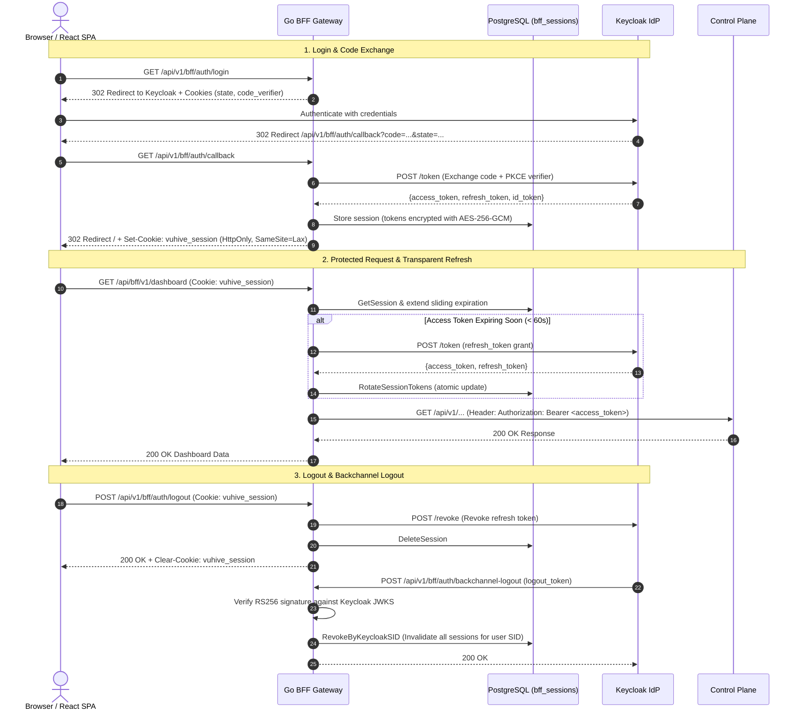

# vuhive-cloud Adoption Guide & API Recipes (Cookbook)

Welcome to the `vuhive-cloud` adoption cookbook. This guide provides an end-to-end walkthrough for test engineers, DevOps specialists, and platform architects looking to build, schedule, execute, and monitor distributed load testing workloads on Kubernetes with `vuhive-cloud`.

> **Documentation Navigation**:
> - **System Overview & Architecture**: [`README.md`](../README.md) and [`ARCHITECTURE_SPEC.md`](../ARCHITECTURE_SPEC.md)
> - **Developer & Contributor Guide**: [`CONTRIBUTING.md`](../CONTRIBUTING.md)
> - **Installation Guides**: [Control Plane Helm Chart (`deploy/helm/vuhive-cloud/README.md`)](../deploy/helm/vuhive-cloud/README.md) and [Infrastructure Helm Chart (`deploy/helm/vuhive-cloud-infra/README.md`)](../deploy/helm/vuhive-cloud-infra/README.md)
> - **REST API Specification**: [OpenAPI 3.1 Reference (`api/openapi.yaml`)](../api/openapi.yaml) (served live at `GET /openapi.yaml` and `GET /openapi.json`)
> - **Engineering Philosophy**: [Spec-Driven Development & AI Disclosure (`AI_DISCLOSURE.md`)](../AI_DISCLOSURE.md)

---

## Table of Contents

- [1. Core Domain Concepts](#1-core-domain-concepts)
- [2. Authoring & Packaging Load Tests](#2-authoring--packaging-load-tests)
  - [A. Test Scenario Structure](#a-test-scenario-structure)
  - [B. Packaging Source Archives](#b-packaging-source-archives)
  - [C. Scenario Configuration (`vuhive.yaml`)](#c-scenario-configuration-vuhiveyaml)
- [3. Control Plane API Recipes](#3-control-plane-api-recipes)
  - [Recipe 1: Registering a Test Suite & Uploading Source Packages](#recipe-1-registering-a-test-suite--uploading-source-packages)
  - [Recipe 2: Monitoring Build Status & Inspecting Artifacts](#recipe-2-monitoring-build-status--inspecting-artifacts)
  - [Recipe 3: Defining & Managing Reusable Runner Profiles](#recipe-3-defining--managing-reusable-runner-profiles)
  - [Recipe 4: Managing Scheduled Test Runs with Kubernetes CronJobs](#recipe-4-managing-scheduled-test-runs-with-kubernetes-cronjobs)
  - [Recipe 5: Dispatching Ad-Hoc Test Executions & Job Lifecycle](#recipe-5-dispatching-ad-hoc-test-executions--job-lifecycle)
  - [Recipe 6: Reporting Run Completion, Ingesting KPIs & Querying Historical Runs](#recipe-6-reporting-run-completion-ingesting-kpis--querying-historical-runs)
  - [Recipe 7: Synchronizing Distributed Multi-Pod Runs with Start Barrier](#recipe-7-synchronizing-distributed-multi-pod-runs-with-start-barrier)
    - [Recipe 8: Aborting & Cancelling In-Flight Test Runs on Demand](#recipe-8-aborting--cancelling-in-flight-test-runs-on-demand)
    - [Recipe 9: Execution Diagnostics, Log Inspection & Troubleshooting](#recipe-9-execution-diagnostics-log-inspection--troubleshooting)
    - [Recipe 10: Adopting the BFF Gateway — Composite Dashboards, Unified Run Details, Reverse Proxying & Real-Time SSE Streaming](#recipe-10-adopting-the-bff-gateway--composite-dashboards-unified-run-details-reverse-proxying--real-time-sse-streaming)
    - [Recipe 11: Accessing the Embedded Web Dashboard, PWA Routing & Accessible Design System](#recipe-11-accessing-the-embedded-web-dashboard--pwa-routing)
    - [Recipe 12: Exploring APIs with Swagger UI & Cross-Origin API Clients (CORS)](#recipe-12-exploring-apis-with-swagger-ui--cross-origin-api-clients-cors)
    - [Recipe 13: Inspecting Control Plane Version Metadata & Health in Automated Pipelines](#recipe-13-inspecting-control-plane-version-metadata--health-in-automated-pipelines)
    - [Recipe 14: Execution Artifact Housekeeping, Storage Retention Policies & Automated Pruning](#recipe-14-execution-artifact-housekeeping-storage-retention-policies--automated-pruning)
    - [Recipe 15: Web UI Micro-Guidance & Domain Concepts Adoption Guide](#recipe-15-web-ui-micro-guidance--domain-concepts-adoption-guide)
    - [Recipe 16: Adopting the Developer CLI (`vuhive`) & Keycloak OIDC Authentication](#recipe-16-adopting-the-developer-cli-vuhive--keycloak-oidc-authentication)
    - [Recipe 17: Deploying Web UI & Go BFF with Helm and Unified Ingress Routing](#recipe-17-deploying-web-ui--go-bff-with-helm-and-unified-ingress-routing)
    - [Recipe 18: BFF Session Management, Sliding Expiration Tuning & Background Janitor Operations](#recipe-18-bff-session-management-sliding-expiration-tuning--background-janitor-operations)
    - [Recipe 19: Keycloak OIDC Client Configuration with PKCE & Backchannel Logout](#recipe-19-keycloak-oidc-client-configuration-with-pkce--backchannel-logout)
    - [Recipe 20: BFF Token Handler, Authentication Endpoints & Transparent Token Refresh](#recipe-20-bff-token-handler-authentication-endpoints--transparent-token-refresh)

---

## 1. Core Domain Concepts

`vuhive-cloud` models load testing workflows through clean domain entities:

- **`TestSuite`**: A logical collection of load test scenarios representing a service or application under test.
- **`Artifact`**: A compiled, self-contained Linux executable generated dynamically by ephemeral Kubernetes build jobs from Go test sources.
- **`RunnerProfile`**: A reusable resource and scheduling specification declaring CPU/memory requests and limits, node selectors, tolerations, and node affinity rules.
- **`Schedule`**: A recurring execution rule mapped 1-to-1 with a native Kubernetes `batch/v1` `CronJob`.
- **`TestRun`**: An individual test execution instance tracking lifecycle states (`QUEUED` $\to$ `RUNNING` $\to$ `COMPLETED` / `FAILED` / `ABORTED`), capturing exit codes, preserving logs, and indexing performance KPIs.
- **`BarrierSession`**: A distributed synchronization rendezvous point enabling multi-pod test workers to align and start load generation simultaneously.

---

## 2. Authoring & Packaging Load Tests

### A. Test Scenario Structure & Inverted Control Contract

`vuhive-cloud` executes Go test modules implementing load testing scenarios with the [`github.com/morphy76/vuhive`](https://github.com/morphy76/vuhive) engine (current release `v1.1.5`).

To enforce consistent operational behavior, signal handling, and metrics collection across distributed Kubernetes runners, `vuhive-cloud` utilizes an **Inverted Control** architectural model:
- **`package scenario` Enforcement:** User test code **must** declare `package scenario`. User-defined `package main` and `func main()` are strictly forbidden.
- **Platform-Managed Driver Injection:** The control plane pre-build analyzer validates the uploaded archive and automatically injects an immutable, trusted `main.go` driver that wires the scenario into `vuhive.NewEngine()`, parsing CLI flags (`--summary-export`, `--config`), capturing OS signals (`SIGINT`, `SIGTERM`), and generating execution telemetry.
- **Direct `go.mod` Dependency:** `go.mod` must explicitly declare a direct `require github.com/morphy76/vuhive <version>` dependency (indirect dependencies are rejected).
- **Import Blocklist Enforcement:** To prevent crypto-mining, backdoors, or non-load-testing batch workloads, the static analyzer blocks dangerous packages: `os/exec`, `syscall`, `unsafe`, `plugin`, `runtime/cgo`, `golang.org/x/sys`, and direct low-level socket creation.

A scenario can implement the contract using any of the supported function or variable signatures:
1. `func NewScenario() *vuhive.Scenario` (or returning `(*vuhive.Scenario, error)`)
2. `func Scenario() *vuhive.Scenario`
3. `func InitScenario() (*vuhive.Scenario, error)`
4. `func Register(engine *vuhive.Engine)`
5. An exported package-level variable `var Scenario = ...`

#### Example `scenario.go`:

```go
// scenario.go
package scenario

import (
	"context"
	"fmt"
	"net/http"
	"time"

	"github.com/morphy76/vuhive"
)

func NewScenario() *vuhive.Scenario {
	client := &http.Client{Timeout: 5 * time.Second}

	return vuhive.NewScenario("User Checkout Flow").
		Step("Homepage", func(ctx context.Context) error {
			resp, err := client.Get("http://target-service.default.svc.cluster.local/healthz")
			if err != nil || resp.StatusCode != http.StatusOK {
				return fmt.Errorf("homepage check failed: %w", err)
			}
			return nil
		})
}
```

The accompanying `go.mod`:

```text
module my-load-test

go 1.26

require github.com/morphy76/vuhive v1.1.5
```

### B. Packaging Source Archives

Compress your test scenario files into a standard `.tar.gz` archive before uploading:

```bash
tar -czvf test-suite.tar.gz scenario.go go.mod
```

> [!TIP]
> You may organize helper packages or multiple Go files inside subdirectories, as long as the scenario entrypoint is declared under `package scenario` and `go.mod` sits at the package root.

### C. Scenario Configuration (`vuhive.yaml`)

You can supply an optional `vuhive.yaml` configuration file within the package or upload it to configure runtime parameters (iterations, ramp-up rate, threshold SLAs):

```yaml
version: "1.0"
execution:
  vus: 50
  duration: 60s
  ramp_up: 10s
thresholds:
  p95_latency_ms: 250
  error_rate_pct: 1.0
```

---

## 3. Control Plane API Recipes

All examples assume the control plane is reachable at `http://vuhive-cloud.vuhive-system.svc.cluster.local:8080` (or `http://localhost:8080` when port-forwarded).

> [!TIP]
> **Interactive API Exploration with Swagger UI**:
> If you deployed the optional OpenAPI viewer in `vuhive-cloud-infra` (`openapiViewer.enabled: true`), you can test all API recipes interactively from your browser at `http://localhost:8081` (via `kubectl port-forward -n vuhive-system svc/vuhive-infra-vuhive-cloud-infra-openapi-viewer 8081:8080`). When accessing via local port-forwarding, set `openapiViewer.specUrl="http://localhost:8080/openapi.json"` so your browser resolves the control plane specification. See [Recipe 12](#recipe-12-exploring-apis-with-swagger-ui--cross-origin-api-clients-cors) for detailed setup.

### Recipe 1: Registering a Test Suite, Attaching Configurations & Uploading Source Packages

#### Step 1: Create a New Test Suite

Create a managed test suite aggregate in `DRAFT` state:

```bash
curl -i -X POST http://localhost:8080/api/v1/suites \
  -H "Content-Type: application/json" \
  -d '{
    "name": "suite-auth-checkout",
    "description": "Checkout service end-to-end load testing suite"
  }'
```

##### Response (`201 Created`):

```json
{
  "id": "3e04a02e-bf34-4398-8b40-6389bca12c97",
  "name": "suite-auth-checkout",
  "description": "Checkout service end-to-end load testing suite",
  "state": "DRAFT",
  "created_at": "2026-09-07T12:00:00Z",
  "updated_at": "2026-09-07T12:00:00Z"
}
```

> [!TIP]
> You can retrieve or update the test suite at any time via `GET /api/v1/suites/3e04a02e-bf34-4398-8b40-6389bca12c97` or transition its state via `PUT /api/v1/suites/3e04a02e-bf34-4398-8b40-6389bca12c97` (`{"name":"suite-auth-checkout","state":"ACTIVE"}`).

#### Step 2: Attach Scenario Configurations (`vuhive.yaml`)

Upload an execution profile specifying virtual users (VUs), duration, ramp-up stages, and SLA latency thresholds:

```bash
curl -i -X POST http://localhost:8080/api/v1/suites/3e04a02e-bf34-4398-8b40-6389bca12c97/configs \
  -H "Content-Type: application/json" \
  -d '{
    "name": "staging-load",
    "content_yaml": "version: \"1.0\"\nexecution:\n  vus: 50\n  duration: 60s\n  ramp_up: 10s\nthresholds:\n  p95_latency_ms: 250\n  error_rate_pct: 1.0\n",
    "is_default": true
  }'
```

##### Response (`201 Created`):

```json
{
  "id": "7fa1205c-d38e-4f51-b924-11883395bcf8",
  "suite_id": "3e04a02e-bf34-4398-8b40-6389bca12c97",
  "name": "staging-load",
  "content_yaml": "version: \"1.0\"\nexecution:\n  vus: 50\n  duration: 60s\n  ramp_up: 10s\nthresholds:\n  p95_latency_ms: 250\n  error_rate_pct: 1.0\n",
  "s3_config_key": "suites/3e04a02e-bf34-4398-8b40-6389bca12c97/configs/7fa1205c-d38e-4f51-b924-11883395bcf8.yaml",
  "is_default": true,
  "created_at": "2026-09-07T12:05:00Z"
}
```

The configuration is staged directly in S3/MinIO and recorded in PostgreSQL. You can inspect attached configurations via `GET /api/v1/suites/3e04a02e-bf34-4398-8b40-6389bca12c97/configs`.

#### Step 3: Upload Source Packages & Trigger Ephemeral Compilation

Upload the Go source archive to trigger synchronous static analysis and schedule an asynchronous compilation build job in Kubernetes:

```bash
curl -i -X POST http://localhost:8080/api/v1/suites/3e04a02e-bf34-4398-8b40-6389bca12c97/builds \
  -F "source=@test-suite.tar.gz" \
  -F "platform=linux/amd64"
```

> [!TIP]
> You can target `linux/amd64` or `linux/arm64`. If `platform` is omitted or set to `all`, artifacts for both architectures will be scheduled for compilation.

#### Pre-Build Static Validation & Fast Rejection:
The control plane executes static analysis **before** accepting the package:
- If `go.mod` is missing or does not require `github.com/morphy76/vuhive` directly, returns `400 Bad Request` with `code: "MISSING_VUHIVE_DEPENDENCY"`.
- If user declares `package main` or `func main()`, returns `400 Bad Request` with `code: "FORBIDDEN_PACKAGE_MAIN"`.
- If user imports a blocked package (e.g. `os/exec`, `syscall`), returns `400 Bad Request` with `code: "FORBIDDEN_IMPORT"`.
- If no scenario contract is found, returns `400 Bad Request` with `code: "MISSING_SCENARIO_CONTRACT"`.

#### Bypassing Blocklist via Insecure Import Override:
If your cluster administrator enabled insecure import overrides (`ALLOW_INSECURE_IMPORTS=true` or Helm `build.allowInsecureImports: true`), you can bypass the import blocklist by passing `allow_insecure_imports=true`:

```bash
curl -i -X POST http://localhost:8080/api/v1/suites/suite-auth-checkout/builds \
  -F "source=@test-suite.tar.gz" \
  -F "platform=linux/amd64" \
  -F "allow_insecure_imports=true"
```

> [!CAUTION]
> If cluster policy forbids overrides, attempting to pass `allow_insecure_imports=true` will be rejected with `403 Forbidden` (`code: "INSECURE_OVERRIDE_FORBIDDEN"`). Artifacts built with insecure imports enabled are flagged with `is_dangerous: true`.

#### Response (`202 Accepted`):

```json
{
  "message": "build triggered successfully",
  "artifacts": [
    {
      "id": "c7a6e118-20ab-48d6-953b-e01140026e61",
      "suite_id": "suite-auth-checkout",
      "platform": "linux/amd64",
      "status": "PENDING",
      "created_at": "2026-09-05T10:00:00Z"
    }
  ]
}
```

The control plane creates an ephemeral Kubernetes `batch/v1` `Job` running `golang:1.26-alpine` in the builder namespace (`vuhive-system`). The job compiles the Go source into a statically linked binary and uploads it to the configured S3 bucket.

> [!TIP]
> **In-Cluster & CI/CD Probe File Staging (Avoiding `kubectl cp` Tar Dependency)**:
> When staging source packages from inside a Kubernetes cluster using an ephemeral probe or debug container (e.g. `curlimages/curl:latest`), standard `kubectl cp` will fail with `command terminated with exit code 3` because minimal curl images do not contain the `tar` binary.
> To stage archives without container dependencies, stream the file via the Base64 stdin pipeline:
> ```bash
> base64 < test-suite.tar.gz | kubectl exec -i -n vuhive-system curl-test -- sh -c 'base64 -d > /tmp/test-suite.tar.gz'
> ```
> Alternatively, deploy an Alpine probe image with `tar` pre-installed (`alpine:3.20` with `apk add --no-cache curl tar`) to enable native `kubectl cp`.

---

### Recipe 2: Monitoring Build Status & Inspecting Artifacts

Poll the artifact registry endpoint to verify build progress and obtain the compiled binary S3 key and SHA256 checksum:

```bash
curl -s http://localhost:8080/api/v1/suites/suite-auth-checkout/artifacts | jq .
```

#### Response (`200 OK`):

```json
{
  "artifacts": [
    {
      "id": "c7a6e118-20ab-48d6-953b-e01140026e61",
      "suite_id": "suite-auth-checkout",
      "platform": "linux/amd64",
      "s3_binary_key": "artifacts/suites/suite-auth-checkout/linux-amd64-c7a6e118",
      "sha256_checksum": "e3b0c44298fc1c149afbf4c8996fb92427ae41e4649b934ca495991b7852b855",
      "status": "READY",
      "created_at": "2026-09-05T10:00:00Z"
    }
  ],
  "count": 1
}
```

When `status` reaches `READY`, the artifact is available for execution by runner pods. If compilation encounters compiler errors or syntax violations, `status` becomes `FAILED` and `error_message` contains the diagnostic logs.

---

### Recipe 2b: Retrying a Failed Build

If a build fails (e.g., a missing `go.mod` or a compile-time error), fix your source code locally and re-upload the corrected archive using the **same endpoint** as Recipe 1 — no additional steps required:

```bash
# Fix your source, re-package, and re-upload
tar -czvf test-suite-fixed.tar.gz scenario.go go.mod

curl -i -X POST http://localhost:8080/api/v1/suites/suite-auth-checkout/builds \
  -F "source=@test-suite-fixed.tar.gz" \
  -F "platform=linux/amd64"
```

The control plane automatically:
1. Detects the existing `FAILED` artifact for the requested platform.
2. Calls `RetryBuild()` on the domain entity — resetting its state from `FAILED → PENDING` and clearing error metadata.
3. Persists the reset artifact to the database.
4. Prunes the stale Kubernetes `batch/v1` Job from the previous failed attempt (background deletion, so no "already exists" conflict).
5. Dispatches a fresh compilation Job against the newly uploaded sources.

> [!TIP]
> You can verify the artifact was reset by polling `GET /api/v1/suites/{id}/artifacts` — you should see `"status": "PENDING"` immediately after the `POST` returns, transitioning to `"BUILDING"` within a few seconds.

---

### Recipe 3: Defining & Managing Reusable Runner Profiles

Runner Profiles decouple test suite logic from cluster compute topology. A profile encapsulates resource constraints, node affinity, and tolerations.

#### 1. Create a Runner Profile:

```bash
curl -i -X POST http://localhost:8080/api/v1/profiles \
  -H "Content-Type: application/json" \
  -d '{
    "name": "high-cpu-isolated-runners",
    "description": "Dedicated performance testing node pool profile",
    "runner_image": "alpine:3.20",
    "cpu_request": "2000m",
    "cpu_limit": "4000m",
    "memory_request": "4Gi",
    "memory_limit": "8Gi",
    "node_selector": {
      "node-role.kubernetes.io/performance-runner": "true"
    },
    "affinity": {
      "node_selector_terms": [
        {
          "key": "topology.kubernetes.io/zone",
          "operator": "In",
          "values": ["us-east-1a", "us-east-1b"]
        }
      ]
    },
    "tolerations": [
      {
        "key": "performance-tests-only",
        "operator": "Exists",
        "effect": "NoSchedule"
      }
    ]
  }'
```

#### Response (`201 Created`):

```json
{
  "id": "e8d665b1-2e67-4228-8ab6-79c5b248a31e",
  "name": "high-cpu-isolated-runners",
  "description": "Dedicated performance testing node pool profile",
  "runner_image": "alpine:3.20",
  "cpu_request": "2000m",
  "cpu_limit": "4000m",
  "memory_request": "4Gi",
  "memory_limit": "8Gi",
  "node_selector": {
    "node-role.kubernetes.io/performance-runner": "true"
  },
  "affinity": {
    "node_selector_terms": [
      {
        "key": "topology.kubernetes.io/zone",
        "operator": "In",
        "values": ["us-east-1a", "us-east-1b"]
      }
    ]
  },
  "tolerations": [
    {
      "key": "performance-tests-only",
      "operator": "Exists",
      "effect": "NoSchedule"
    }
  ],
  "created_at": "2026-09-05T10:05:00Z",
  "updated_at": "2026-09-05T10:05:00Z"
}
```

#### 2. List Profiles:

```bash
curl -s http://localhost:8080/api/v1/profiles | jq .
```

#### 3. Update an Existing Profile:

```bash
curl -i -X PUT http://localhost:8080/api/v1/profiles/e8d665b1-2e67-4228-8ab6-79c5b248a31e \
  -H "Content-Type: application/json" \
  -d '{
    "name": "high-cpu-isolated-runners",
    "cpu_request": "4000m",
    "cpu_limit": "8000m",
    "memory_request": "8Gi",
    "memory_limit": "16Gi"
  }'
```

#### 4. Delete a Profile:

```bash
curl -i -X DELETE http://localhost:8080/api/v1/profiles/e8d665b1-2e67-4228-8ab6-79c5b248a31e
```

---

### Recipe 4: Managing Scheduled Test Runs with Kubernetes CronJobs

`vuhive-cloud` provides native Kubernetes CronJob orchestration. Creating a schedule registers a persistent record in PostgreSQL and instantiates a `batch/v1` `CronJob` in the runner namespace.

#### 1. Create a Scheduled Execution:

```bash
curl -i -X POST http://localhost:8080/api/v1/schedules \
  -H "Content-Type: application/json" \
  -d '{
    "suite_id": "suite-auth-checkout",
    "artifact_id": "c7a6e118-20ab-48d6-953b-e01140026e61",
    "runner_profile_id": "e8d665b1-2e67-4228-8ab6-79c5b248a31e",
    "name": "nightly-checkout-benchmark",
    "cron_expression": "0 2 * * *"
  }'
```

#### Response (`201 Created`):

```json
{
  "id": "7fa1205c-d38e-4f51-b924-11883395bcf8",
  "suite_id": "suite-auth-checkout",
  "artifact_id": "c7a6e118-20ab-48d6-953b-e01140026e61",
  "runner_profile_id": "e8d665b1-2e67-4228-8ab6-79c5b248a31e",
  "name": "nightly-checkout-benchmark",
  "cron_expression": "0 2 * * *",
  "k8s_cronjob_name": "vuhive-sched-7fa1205c",
  "is_active": true,
  "created_at": "2026-09-05T10:10:00Z",
  "updated_at": "2026-09-05T10:10:00Z"
}
```

Verify the native Kubernetes CronJob:

```bash
kubectl get cronjob -n vuhive-runners vuhive-sched-7fa1205c
```

#### 2. Update Schedule Cadence:

```bash
curl -i -X PUT http://localhost:8080/api/v1/schedules/7fa1205c-d38e-4f51-b924-11883395bcf8 \
  -H "Content-Type: application/json" \
  -d '{
    "cron_expression": "*/30 * * * *"
  }'
```

#### 3. Delete a Schedule:

```bash
curl -i -X DELETE http://localhost:8080/api/v1/schedules/7fa1205c-d38e-4f51-b924-11883395bcf8
```
Deletes both the database aggregate and the underlying Kubernetes `CronJob`.

---

### Recipe 5: Dispatching Ad-Hoc Test Executions & Job Lifecycle

#### 1. Triggering Ad-Hoc Runs via REST API (`POST /api/v1/runs`):

To run an immediate ad-hoc test execution programmatically or from CI/CD pipelines, POST a run request to the control plane API. You must specify an active `TestSuite`, a compiled and `READY` `Artifact`, a `RunnerProfile`, and an optional scenario configuration:

```bash
curl -i -X POST http://localhost:8080/api/v1/runs \
  -H "Content-Type: application/json" \
  -d '{
    "suite_id": "suite-auth-checkout",
    "artifact_id": "c7a6e118-20ab-48d6-953b-e01140026e61",
    "runner_profile_id": "e8d665b1-2e67-4228-8ab6-79c5b248a31e",
    "configuration_id": "d1a85f64-5717-4562-b3fc-2c963f66afa7"
  }'
```

##### Response (`201 Created`):

```json
{
  "id": "a1b2c3d4-e5f6-7890-abcd-ef0123456789",
  "suite_id": "suite-auth-checkout",
  "artifact_id": "c7a6e118-20ab-48d6-953b-e01140026e61",
  "configuration_id": "d1a85f64-5717-4562-b3fc-2c963f66afa7",
  "runner_profile_id": "e8d665b1-2e67-4228-8ab6-79c5b248a31e",
  "status": "QUEUED",
  "k8s_job_name": "vuhive-run-a1b2c3d4",
  "k8s_namespace": "vuhive-runners",
  "metrics": {
    "total_iterations": 0,
    "total_requests": 0,
    "avg_tps": 0,
    "p50_duration_ms": 0,
    "p90_duration_ms": 0,
    "p95_duration_ms": 0,
    "p99_duration_ms": 0,
    "error_rate_pct": 0
  },
  "created_at": "2026-09-05T10:15:00Z"
}
```

The control plane:
1. Validates that the `TestSuite` is `ACTIVE`.
2. Validates that the target `Artifact` is in `READY` status and belongs to the suite.
3. Validates the `RunnerProfile` and resource limits.
4. Creates a `TestRun` domain entity in `QUEUED` status and persists it in PostgreSQL.
5. Dispatches an ephemeral Kubernetes `batch/v1` `Job` named `vuhive-run-<run_id>` in the runner namespace (`vuhive-runners`).

#### 2. Dispatching from a Configured Schedule Template:

To run an immediate ad-hoc test execution using the pre-configured runner profile, artifact, and environment from an existing Schedule, instantiate a Job directly from the CronJob:

```bash
kubectl create job nightly-adhoc-manual-1 \
  --from=cronjob/vuhive-sched-7fa1205c \
  -n vuhive-runners
```

The control plane Informer Watcher (`RunnerJobWatcher`) detects the newly spawned Job, inspects its `vuhive.io/schedule-id` label, auto-creates a correlated `TestRun` entity in `QUEUED` status, and tracks its execution lifecycle. The `TestRun` record stores:
- `k8s_job_name`: the Kubernetes Job name (e.g. `vuhive-sched-7fa1205c-28492020`)
- `k8s_namespace`: the **actual** namespace where the Job ran (e.g. `vuhive-runners`), not a hard-coded default

> **Run Correlation for CronJob-spawned pods**: The runner pod's `VUHIVE_RUN_ID` environment variable is populated from `metadata.labels['batch.kubernetes.io/job-name']` — the Kubernetes Job name automatically injected onto every pod in the Job. When the runner-wrapper POSTs the completion callback with `run_id = <job-name>`, the control plane resolves the `TestRun` first by UUID lookup, then by `k8s_job_name` as a fallback, ensuring the completion report and KPIs are always correctly indexed.

#### 3. Pod Lifecycle & Security Architecture:

When the runner Job spawns:
```text
┌────────────────────────────────────────────────────────────────────────┐
│ Kubernetes Runner Pod (Restricted Pod Security Standard)               │
│                                                                        │
│ 1. Init Container: runner-init                                         │
│    - Downloads target binary and vuhive.yaml from S3                  │
│    - Populates /shared emptyDir with runner executable & wrapper       │
│                                                                        │
│ 2. Main Container: runner (e.g. alpine:3.20)                           │
│    - Runs non-root (UID 10001), readOnlyRootFilesystem                 │
│    - Executes runner-wrapper in /shared                                │
│    - Captures stdout/stderr into /shared/run.log                       │
│    - Generates deterministic /shared/summary.json                      │
│                                                                        │
│ 3. Wrapper Finalization:                                               │
│    - Uploads run.log & summary.json to S3                             │
│    - Invokes POST /api/v1/runs/complete (or /:id/complete) callback   │
└────────────────────────────────────────────────────────────────────────┘
```

Monitor execution progress in Kubernetes:

```bash
kubectl wait --namespace vuhive-runners \
  --for=condition=complete job/nightly-adhoc-manual-1 \
  --timeout=180s
```

---

### Recipe 6: Reporting Run Completion, Ingesting KPIs & Querying Historical Runs

Upon workload completion, the runner wrapper uploads execution artifacts to S3 and notifies the control plane callback endpoint.

The control plane exposes two interchangeable callback routes:
1. **Body-driven (`POST /api/v1/runs/complete`)**: Invoked by standard runner pods, where `run_id` is passed within the request body.
2. **Path-driven (`POST /api/v1/runs/{id}/complete`)**: Where `id` is specified in the URL path.

#### Callback Network & DNS Considerations
In Kubernetes environments:
- When runners share the control plane namespace, `API_CALLBACK_URL` defaults to the unqualified service name `http://<fullname>:<port>/api/v1/runs/complete`, avoiding DNS search domain overhead.
- When runners execute in a separate namespace (e.g., `vuhive-runners`), `API_CALLBACK_URL` defaults to the absolute FQDN with a trailing dot: `http://<fullname>.<namespace>.svc.cluster.local.:<port>/api/v1/runs/complete`. This trailing dot prevents standard Linux `/etc/resolv.conf` `ndots:5` lookups from leaking to external upstream DHCP search domains before reaching CoreDNS.

#### Triggering Callback via POST /api/v1/runs/complete:

```bash
curl -i -X POST http://localhost:8080/api/v1/runs/complete \
  -H "Content-Type: application/json" \
  -d '{
    "run_id": "98bc19d4-1a3b-4882-a982-ff012498beaa",
    "exit_code": 0,
    "report_key": "runs/98bc19d4/summary.json",
    "logs_key": "runs/98bc19d4/run.log",
    "finished_at": "2026-09-05T10:15:30Z",
    "summary": {
      "total_iterations": 25000,
      "total_requests": 100000,
      "avg_tps": 1666.67,
      "p50_duration_ms": 12.4,
      "p90_duration_ms": 28.1,
      "p95_duration_ms": 45.2,
      "p99_duration_ms": 89.6,
      "error_rate_pct": 0.02,
      "status": "PASS"
    }
  }'
```

Alternatively, you can call the path-scoped endpoint `POST /api/v1/runs/98bc19d4-1a3b-4882-a982-ff012498beaa/complete`:

```bash
curl -i -X POST http://localhost:8080/api/v1/runs/98bc19d4-1a3b-4882-a982-ff012498beaa/complete \
  -H "Content-Type: application/json" \
  -d '{
    "exit_code": 0,
    "report_key": "runs/98bc19d4/summary.json",
    "logs_key": "runs/98bc19d4/run.log",
    "finished_at": "2026-09-05T10:15:30Z",
    "summary": {
      "total_iterations": 25000,
      "total_requests": 100000,
      "avg_tps": 1666.67,
      "p50_duration_ms": 12.4,
      "p90_duration_ms": 28.1,
      "p95_duration_ms": 45.2,
      "p99_duration_ms": 89.6,
      "error_rate_pct": 0.02,
      "status": "PASS"
    }
  }'
```

#### Response (`200 OK`):

```json
{
  "id": "98bc19d4-1a3b-4882-a982-ff012498beaa",
  "suite_id": "suite-auth-checkout",
  "artifact_id": "c7a6e118-20ab-48d6-953b-e01140026e61",
  "runner_profile_id": "e8d665b1-2e67-4228-8ab6-79c5b248a31e",
  "status": "COMPLETED",
  "exit_code": 0,
  "sla_passed": true,
  "metrics": {
    "total_iterations": 25000,
    "total_requests": 100000,
    "avg_tps": 1666.67,
    "p50_duration_ms": 12.4,
    "p90_duration_ms": 28.1,
    "p95_duration_ms": 45.2,
    "p99_duration_ms": 89.6,
    "error_rate_pct": 0.02
  },
  "s3_report_key": "runs/98bc19d4/summary.json",
  "s3_logs_key": "runs/98bc19d4/run.log",
  "started_at": "2026-09-05T10:14:30Z",
  "finished_at": "2026-09-05T10:15:30Z",
  "created_at": "2026-09-05T10:14:25Z"
}
```

Performance KPIs (`p50`, `p90`, `p95`, `p99`, `avg_tps`, `error_rate_pct`) are automatically indexed in PostgreSQL for querying, SLA threshold assertions, and historical trend analysis.

#### 2. Listing & Filtering Historical Test Runs:

Query runs across suites, statuses, schedules, or time ranges with pagination:

```bash
curl -s "http://localhost:8080/api/v1/runs?suite_id=suite-auth-checkout&status=COMPLETED&limit=10" | jq .
```

##### Response (`200 OK`):

```json
{
  "runs": [
    {
      "id": "98bc19d4-1a3b-4882-a982-ff012498beaa",
      "suite_id": "suite-auth-checkout",
      "artifact_id": "c7a6e118-20ab-48d6-953b-e01140026e61",
      "runner_profile_id": "e8d665b1-2e67-4228-8ab6-79c5b248a31e",
      "status": "COMPLETED",
      "started_at": "2026-09-05T10:14:30Z",
      "finished_at": "2026-09-05T10:15:30Z",
      "duration_ms": 60000,
      "exit_code": 0,
      "sla_passed": true,
      "metrics": {
        "total_iterations": 25000,
        "total_requests": 100000,
        "avg_tps": 1666.67,
        "p50_duration_ms": 12.4,
        "p90_duration_ms": 28.1,
        "p95_duration_ms": 45.2,
        "p99_duration_ms": 89.6,
        "error_rate_pct": 0.02
      },
      "s3_report_key": "runs/98bc19d4/summary.json",
      "s3_logs_key": "runs/98bc19d4/run.log",
      "created_at": "2026-09-05T10:14:25Z"
    }
  ],
  "count": 1,
  "total": 1,
  "limit": 10,
  "offset": 0
}
```

#### 3. Inspecting Run Details & Indexed Performance KPIs:

Retrieve a single test run by its UUID:

```bash
curl -s http://localhost:8080/api/v1/runs/98bc19d4-1a3b-4882-a982-ff012498beaa | jq .
```


---

### Recipe 7: Synchronizing Distributed Multi-Pod Runs with Start Barrier

When distributing a massive load test across multiple worker pods, all workers must begin generating traffic at the exact same instant to accurately benchmark system concurrency and spike absorption. `vuhive-cloud` includes a built-in start barrier rendezvous coordinator.

#### 1. Worker Pods Await Rendezvous:

Each participating worker calls `/barrier/await` declaring its worker ID and total expected worker count:

```bash
# Executed by Worker 1
curl -s -X POST http://localhost:8080/api/v1/runs/dist-run-001/barrier/await \
  -H "Content-Type: application/json" \
  -d '{
    "worker_id": "worker-pod-0",
    "total_workers": 2,
    "timeout_ms": 30000,
    "release_delay_ms": 5000
  }'
```

```bash
# Executed by Worker 2
curl -s -X POST http://localhost:8080/api/v1/runs/dist-run-001/barrier/await \
  -H "Content-Type: application/json" \
  -d '{
    "worker_id": "worker-pod-1",
    "total_workers": 2,
    "timeout_ms": 30000,
    "release_delay_ms": 5000
  }'
```

#### Response (`200 OK` to both workers once the barrier releases):

```json
{
  "run_id": "dist-run-001",
  "status": "RELEASED",
  "total_workers": 2,
  "ready_workers": 2,
  "target_start_time": "2026-09-05T10:20:05.123456Z",
  "start_in_ms": 4982,
  "participants": [
    {
      "worker_id": "worker-pod-0",
      "status": "READY",
      "joined_at": "2026-09-05T10:20:00.100Z",
      "ready_at": "2026-09-05T10:20:00.123Z"
    },
    {
      "worker_id": "worker-pod-1",
      "status": "READY",
      "joined_at": "2026-09-05T10:20:00.105Z",
      "ready_at": "2026-09-05T10:20:00.123Z"
    }
  ]
}
```

Both workers receive a synchronized `target_start_time` and countdown delay (`start_in_ms`), releasing simultaneously without clock drift.

#### 2. Querying Barrier Status:

Inspect live rendezvous state:

```bash
curl -s http://localhost:8080/api/v1/runs/dist-run-001/barrier | jq .
```

#### 3. Aborting a Barrier Rendezvous:

If a worker encounters an unrecoverable initialization error prior to start, it can signal an immediate abort to release other waiting workers gracefully:

```bash
curl -i -X POST http://localhost:8080/api/v1/runs/dist-run-001/barrier/abort \
  -H "Content-Type: application/json" \
  -d '{
    "worker_id": "worker-pod-1",
    "reason": "Failed pre-allocating network socket pool"
  }'
```

---

### Recipe 8: Aborting & Cancelling In-Flight Test Runs on Demand

If an active test execution behaves unexpectedly, introduces critical service degradation against the system under test, or exhausts cluster capacity, operators and automated CI/CD controllers can immediately abort the execution via `POST /api/v1/runs/{id}/abort`.

#### 1. Abort an Active Execution:

```bash
curl -i -X POST http://localhost:8080/api/v1/runs/98bc19d4-1a3b-4882-a982-ff012498beaa/abort \
  -H "Content-Type: application/json" \
  -d '{
    "reason": "Observed unexpected latency spike exceeding SLA boundaries",
    "requested_by": "qa-automation-pipeline"
  }'
```

#### Response (`200 OK`):

```json
{
  "id": "98bc19d4-1a3b-4882-a982-ff012498beaa",
  "suite_id": "suite-auth-checkout",
  "artifact_id": "c7a6e118-20ab-48d6-953b-e01140026e61",
  "runner_profile_id": "e8d665b1-2e67-4228-8ab6-79c5b248a31e",
  "status": "ABORTED",
  "k8s_job_name": "vuhive-run-98bc19d4",
  "k8s_namespace": "vuhive-runners",
  "abort_reason": "Observed unexpected latency spike exceeding SLA boundaries (requested by: qa-automation-pipeline)",
  "started_at": "2026-09-05T10:14:30Z",
  "finished_at": "2026-09-05T10:15:02Z",
  "created_at": "2026-09-05T10:14:25Z"
}
```

#### 2. Workload Teardown & Lifecycle Mechanics:
- **Kubernetes Job & Pod Termination**: The control plane deletes the underlying `batch/v1` Job and dispatches immediate deletion signals to runner pods.
- **Graceful SIGTERM Propagation**: The runner wrapper traps `SIGTERM`, forwards it to the scenario process, allows an initial grace window for partial stdout/stderr log flushing, and attempts guaranteed upload of remaining logs to S3.
- **State Machine Protection**: Only `QUEUED` and `RUNNING` executions can be aborted. If a run has already finalized (`COMPLETED`, `FAILED`, or `ABORTED`), the endpoint returns `409 Conflict`.
- **Informer Watcher Resilience**: The Kubernetes informer watcher cleanly detects the deletion timestamp and avoids falsely flagging the aborted run as a system failure.

---

### Recipe 9: Execution Diagnostics, Log Inspection & Troubleshooting

#### 1. Fetching Execution Logs & Reports via REST API:

Developers and CI/CD pipelines can retrieve logs and summary reports directly from the control plane without configuring cloud storage credentials or CLI tools:

##### Stream Raw Execution Logs:

```bash
curl -s http://localhost:8080/api/v1/runs/98bc19d4-1a3b-4882-a982-ff012498beaa/logs
```

Or generate a secure presigned S3 direct-download URL (valid for 15 minutes):

```bash
curl -s "http://localhost:8080/api/v1/runs/98bc19d4-1a3b-4882-a982-ff012498beaa/logs?presign=true" | jq .
```

##### Download Full Raw Summary Report (`summary.json`):

```bash
curl -s http://localhost:8080/api/v1/runs/98bc19d4-1a3b-4882-a982-ff012498beaa/report | jq .
```

Or obtain a presigned download URL:

```bash
curl -s "http://localhost:8080/api/v1/runs/98bc19d4-1a3b-4882-a982-ff012498beaa/report?presign=true" | jq .
```

#### 2. Alternative: Direct S3 / MinIO Object Storage Download:

For cluster administrators with object storage credentials, tools like the AWS CLI or MinIO client (`mc`) can access artifacts directly:

```bash
# Configure AWS CLI for local MinIO
export AWS_ACCESS_KEY_ID=vuhive-dev
export AWS_SECRET_ACCESS_KEY=vuhive-dev-secret
export AWS_ENDPOINT_URL=http://localhost:9000

# Download execution log
aws --endpoint-url=http://localhost:9000 s3 cp \
  s3://vuhive-artifacts/runs/98bc19d4/run.log ./run.log

# Download complete summary report
aws --endpoint-url=http://localhost:9000 s3 cp \
  s3://vuhive-artifacts/runs/98bc19d4/summary.json ./summary.json
```

#### 3. Inspecting Runner Pod Status via `kubectl`:

```bash
# List runner pods
kubectl get pods -n vuhive-runners -l app.kubernetes.io/managed-by=vuhive-cloud

# Check init container logs (artifact download & setup)
kubectl logs -n vuhive-runners pod/<pod-name> -c runner-init

# Check main runner container execution logs
kubectl logs -n vuhive-runners pod/<pod-name> -c runner
```

#### 4. Common Error Handling Reference:

| HTTP Status | Error String | Cause | Resolution |
|---|---|---|---|
| `400 Bad Request` | `invalid request payload: ...` | Malformed JSON or missing required fields. | Validate request body against API schema. |
| `404 Not Found` | `suite not found`, `run not found`, `artifact not found` | The requested UUID does not exist or artifacts have not been uploaded to S3. | Verify IDs via query endpoints and check run status is `COMPLETED` or `FAILED`. |
| `404 Not Found` | `report not found` or `logs not found` | S3 artifacts not yet uploaded. | Await run completion before fetching reports/logs. |
| `409 Conflict` | `cannot transition from a terminal state` | Attempted to abort or complete an already finalized run. | Run is already terminal (`COMPLETED`, `FAILED`, or `ABORTED`). |
| `409 Conflict` | `build job already running` | A compilation job is already active (`BUILDING`) for this suite/platform. | Await completion before re-uploading. Uploads against a `FAILED` artifact automatically retry — no 409 is returned. |
| `409 Conflict` | `test run is still in progress` | Report or logs queried while the runner pod is still running. | Await run completion before fetching reports/logs. |
| `424 Failed Dependency` | `barrier rendezvous aborted` | Start barrier rendezvous was cancelled by a worker failure. | Inspect worker initialization logs and restart run. |
| `422 Unprocessable Entity` | `unsupported target platform` | Platform is not `linux/amd64` or `linux/arm64`. | Specify valid platform architecture. |
| CLI / `kubectl` | `command terminated with exit code 3` | `kubectl cp` executed against a minimal container lacking `tar` (e.g. `curlimages/curl:latest`). | Use Base64 stdin pipeline: `base64 < archive.tar.gz \| kubectl exec -i ... -- sh -c 'base64 -d > /tmp/archive.tar.gz'` or use an Alpine probe image with `tar`. |

---

### Recipe 10: Adopting the BFF Gateway — Composite Dashboards, Unified Run Details, Reverse Proxying & Real-Time SSE Streaming

The Backend-For-Frontend service (`cmd/bff`) acts as high-throughput presentation gateway for the web dashboard (`web/`) and automation clients. It decouples UI requirements from backend domain services by providing concurrent composite aggregation, enriched run detail responses with direct S3 artifact links, real-time Server-Sent Events (SSE) telemetry streaming, and transparent reverse proxying for entity CRUD operations.

#### 1. Fetching the Composite Dashboard Overview

The dashboard endpoint concurrently queries system health, active test runs count, recent test suites, and runner profiles within a single round-trip (<50ms):

```bash
curl -s -i http://localhost:8081/api/bff/v1/dashboard
```

Expected response (`200 OK`):

```json
{
  "bff_status": "UP",
  "bff_version": "0.1.0",
  "control_plane_status": "UP",
  "control_plane_version": "0.0.1",
  "active_runs_count": 2,
  "recent_suites": [
    {
      "id": "3fa85f64-5717-4562-b3fc-2c963f66afa6",
      "name": "checkout-stress-test",
      "description": "End-to-end checkout flow load test",
      "state": "ACTIVE",
      "created_at": "2026-09-06T10:00:00Z",
      "updated_at": "2026-09-06T10:05:00Z"
    }
  ],
  "profiles_count": 1,
  "profiles_summary": [
    {
      "id": "e8d665b1-2e67-4228-8ab6-79c5b248a31e",
      "name": "standard-worker",
      "description": "Standard load generator profile",
      "runner_image": "vuhive/runner-default:v1.0.0",
      "cpu_request": "1000m",
      "cpu_limit": "2000m",
      "memory_limit": "4Gi",
      "created_at": "2026-09-06T09:00:00Z"
    }
  ],
  "timestamp": "2026-09-06T12:00:00Z"
}
```

#### 2. Querying Unified Run Details with Pre-Signed Artifact Links

The unified run detail endpoint combines execution metadata, parsed performance KPIs, and direct pre-signed S3 download URLs for `summary.json` and `run.log`:

```bash
curl -s -i http://localhost:8081/api/bff/v1/runs/a1b2c3d4-e5f6-7a8b-9c0d-1e2f3a4b5c6d
```

Expected response (`200 OK`):

```json
{
  "id": "a1b2c3d4-e5f6-7a8b-9c0d-1e2f3a4b5c6d",
  "suite_id": "3fa85f64-5717-4562-b3fc-2c963f66afa6",
  "artifact_id": "c7a6e118-20ab-48d6-953b-e01140026e61",
  "runner_profile_id": "e8d665b1-2e67-4228-8ab6-79c5b248a31e",
  "status": "COMPLETED",
  "k8s_job_name": "vuhive-run-a1b2c3d4",
  "k8s_namespace": "vuhive-runners",
  "duration_ms": 60000,
  "exit_code": 0,
  "sla_passed": true,
  "metrics": {
    "total_iterations": 15000,
    "total_requests": 45000,
    "avg_tps": 750.5,
    "p50_duration_ms": 12.4,
    "p90_duration_ms": 25.1,
    "p95_duration_ms": 38.6,
    "p99_duration_ms": 85.2,
    "error_rate_pct": 0.02
  },
  "s3_report_key": "runs/a1b2c3d4/summary.json",
  "s3_logs_key": "runs/a1b2c3d4/run.log",
  "created_at": "2026-09-06T12:00:00Z",
  "artifact_links": {
    "report_url": "http://localhost:9000/vuhive-artifacts/runs/a1b2c3d4/summary.json?X-Amz-Signature=...",
    "logs_url": "http://localhost:9000/vuhive-artifacts/runs/a1b2c3d4/run.log?X-Amz-Signature=..."
  }
}
```

#### 3. Transparent Entity CRUD Reverse Proxying

The BFF acts as a transparent reverse proxy for entity operations, automatically forwarding requests to the upstream control plane (`/api/bff/v1/*` $\to$ `/api/v1/*`) while maintaining connection pooling, Bearer token propagation, and retries:

```bash
# List runner profiles via BFF proxy:
curl -s -i http://localhost:8081/api/bff/v1/profiles

# Dispatch an ad-hoc test run via BFF proxy:
curl -s -i -X POST http://localhost:8081/api/bff/v1/runs \
  -H "Content-Type: application/json" \
  -d '{
    "suite_id": "3fa85f64-5717-4562-b3fc-2c963f66afa6",
    "artifact_id": "c7a6e118-20ab-48d6-953b-e01140026e61",
    "runner_profile_id": "e8d665b1-2e67-4228-8ab6-79c5b248a31e"
  }'

# Abort an active run via BFF proxy:
curl -s -i -X POST http://localhost:8081/api/bff/v1/runs/a1b2c3d4-e5f6-7a8b-9c0d-1e2f3a4b5c6d/abort
```

#### 4. Checking BFF Health & Aggregated Status:

```bash
curl -s -i http://localhost:8081/api/bff/v1/status
```

Expected response (`200 OK`):

```json
{
  "bff_status": "UP",
  "bff_version": "0.1.0",
  "control_plane_status": "UP",
  "control_plane_version": "0.0.1",
  "timestamp": "2026-09-06T12:00:00Z"
}
```

#### 5. Managing Client Sessions:

```bash
# Create client session:
curl -s -i -X POST http://localhost:8081/api/bff/v1/sessions \
  -H "Content-Type: application/json" \
  -d '{
    "session_id": "sess-usr-12345",
    "user_id": "operator@vuhive.local",
    "ttl_seconds": 3600,
    "metadata": {
      "role": "admin"
    }
  }'

# Retrieve active session context:
curl -s -i http://localhost:8081/api/bff/v1/sessions/sess-usr-12345
```

#### 6. Streaming Real-Time Status Updates via Server-Sent Events (SSE)

To eliminate high-frequency browser polling when monitoring in-flight load tests or asynchronous source-to-binary compilations, the BFF exposes a persistent Server-Sent Events (SSE) stream at `GET /api/bff/v1/events` (and legacy alias `GET /api/v1/bff/events`).

##### A. Connecting with cURL

Listen to real-time events from the command line using unbuffered streaming (`curl -N`):

```bash
curl -N -s -H "Accept: text/event-stream" http://localhost:8081/api/bff/v1/events
```

##### B. Connecting with JavaScript (Browser `EventSource`)

Frontend applications establish real-time connectivity with browser-native `EventSource`:

```javascript
const evtSource = new EventSource('/api/bff/v1/events');

// Listen for test run lifecycle transitions (QUEUED -> RUNNING -> COMPLETED/FAILED/ABORTED)
evtSource.addEventListener('run_status_changed', (event) => {
  const payload = JSON.parse(event.data);
  console.log(`Run ${payload.run_id} transitioned: ${payload.previous_status || 'INIT'} -> ${payload.status}`);
  if (payload.status === 'COMPLETED' && payload.metrics) {
    console.log(`TPS: ${payload.metrics.avg_tps}, p95: ${payload.metrics.p95_duration_ms}ms`);
  }
});

// Listen for build status changes (QUEUED -> BUILDING -> READY/FAILED)
evtSource.addEventListener('build_status_changed', (event) => {
  const payload = JSON.parse(event.data);
  console.log(`Artifact ${payload.artifact_id} status: ${payload.status}`);
});

// Periodic keep-alive heartbeats with active cluster telemetry
evtSource.addEventListener('system_heartbeat', (event) => {
  const payload = JSON.parse(event.data);
  console.log(`Heartbeat: BFF ${payload.status}, connected clients: ${payload.active_clients}, active runs: ${payload.active_runs}`);
});

evtSource.onerror = (err) => {
  console.error('SSE connection error:', err);
};
```

##### C. Event Schema Reference

| Event Type | Description | Key Payload Attributes |
|:---|:---|:---|
| `run_status_changed` | Dispatched immediately when a test run changes execution phase (`QUEUED`, `RUNNING`, `COMPLETED`, `FAILED`, `ABORTED`). | `run_id`, `suite_id`, `status`, `previous_status`, `k8s_job_name`, `metrics`, `sla_passed` |
| `build_status_changed` | Dispatched when ephemeral source compilation transitions (`QUEUED`, `BUILDING`, `READY`, `FAILED`). | `artifact_id`, `suite_id`, `platform`, `status`, `previous_status`, `sha256_checksum`, `error_message` |
| `system_heartbeat` | Dispatched periodically (default every 15s) to prevent proxy/NAT timeouts and communicate cluster load. | `status`, `active_clients`, `active_runs`, `timestamp` |

##### Example `run_status_changed` Frame:

```text
id: run-3fa85f64-1
event: run_status_changed
data: {"run_id":"3fa85f64-5717-4562-b3fc-2c963f66afa6","suite_id":"e8d665b1-2e67-4228-8ab6-79c5b248a31e","status":"COMPLETED","previous_status":"RUNNING","started_at":"2026-09-06T22:00:00Z","finished_at":"2026-09-06T22:05:00Z","duration_ms":300000,"exit_code":0,"sla_passed":true,"metrics":{"total_iterations":15000,"total_requests":45000,"avg_tps":750.5,"p50_duration_ms":12.4,"p90_duration_ms":25.1,"p95_duration_ms":38.6,"p99_duration_ms":85.2,"error_rate_pct":0.02},"timestamp":"2026-09-06T22:05:01Z"}
```

> [!NOTE]
> All `/api/bff/v1/*` endpoints are also accessible via their backwards-compatible `/api/v1/bff/*` paths for legacy integrations.

#### 5. Persistent Session Management & Token Handler Architecture

The Go BFF implements the confidential Token Handler pattern, shielding raw OAuth 2.0 access and refresh tokens from browser storage by maintaining an encrypted, `HttpOnly`, `SameSite=Lax` cookie (`vuhive_session`).

##### A. Domain Aggregate & Port Contracts

The BFF encapsulates session state and lifecycle rules in a pure DDD aggregate:

- **Domain Model (`internal/bff/domain/model/session.go`)**:
  - Encapsulates `SessionID`, `UserID`, `KeycloakSID`, `AccessToken`, `RefreshToken`, `IDToken`, `Roles`, `CreatedAt`, `UpdatedAt`, `ExpiresAt`, and `Metadata`.
  - Enforces domain invariants: `IsExpired() bool`, atomic `RotateTokens(accessToken, refreshToken, idToken, ttl)`, sliding expiration `Touch(ttl)`, and explicit `Revoke()`.
  - Supports non-breaking functional options: `WithKeycloakSID`, `WithTokens`, `WithRoles`, `WithMetadata`.
- **Outbound Driven Port (`internal/bff/application/ports/outbound/session_store.go`)**:
  - Declares the `SessionStore` interface with methods: `Create`, `Get`, `Update`, `Delete`, `DeleteByKeycloakSID`, `DeleteByUserID`, and `DeleteExpired`.
- **Storage Adapters**:
  - `MemorySessionStore` (`internal/bff/adapters/outbound/session/memory`): Fast, thread-safe, deep-copying store for unit testing and local development.
  - `PostgresSessionStore` (`internal/bff/adapters/outbound/session/postgres`): Clustered relational store supporting multi-pod horizontal scalability, AES-256-GCM token encryption at rest, and $O(1)$ Keycloak backchannel logout invalidation.

##### B. PostgreSQL Schema & AES-256-GCM Token Encryption

In multi-replica cloud deployments, session persistence in PostgreSQL (`bff_sessions`) eliminates pod-memory loss and guarantees that OIDC backchannel logout invalidations take effect cluster-wide:

```sql
CREATE TABLE IF NOT EXISTS bff_sessions (
    id VARCHAR(128) PRIMARY KEY,
    user_id VARCHAR(255) NOT NULL,
    keycloak_sid VARCHAR(255),
    access_token TEXT NOT NULL DEFAULT '',
    refresh_token TEXT NOT NULL DEFAULT '',
    id_token TEXT,
    roles JSONB NOT NULL DEFAULT '[]'::jsonb,
    metadata JSONB NOT NULL DEFAULT '{}'::jsonb,
    created_at TIMESTAMPTZ NOT NULL DEFAULT NOW(),
    updated_at TIMESTAMPTZ NOT NULL DEFAULT NOW(),
    expires_at TIMESTAMPTZ NOT NULL
);

CREATE INDEX IF NOT EXISTS idx_bff_sessions_keycloak_sid ON bff_sessions(keycloak_sid);
CREATE INDEX IF NOT EXISTS idx_bff_sessions_user_id ON bff_sessions(user_id);
CREATE INDEX IF NOT EXISTS idx_bff_sessions_expires_at ON bff_sessions(expires_at);
```

- **Index Optimization**: Lookups by cookie token hash (`id`) and Keycloak backchannel logout invalidations (`keycloak_sid`) operate in $O(1)$ time, while batch cleanup of expired sessions utilizes `idx_bff_sessions_expires_at`.
- **Encryption at Rest**: When `SESSION_ENCRYPTION_KEY` (a 32-byte hexadecimal, base64, or passphrase string) is configured, the `TokenCipher` utility transparently encrypts `access_token`, `refresh_token`, and `id_token` using authenticated AES-256-GCM with randomized 12-byte nonces before persisting to PostgreSQL.

---


### Recipe 11: Adopting the React 19 Web Interface & Embedded PWA

Milestone 1.5 introduces the official web dashboard under `web/`. Built with **React 19**, **Vite 6**, **TypeScript**, and **Tailwind CSS v4**, the interface delivers an adaptive, fluid responsive shell across mobile devices (375px), tablets, and desktop workstations, with zero-overhead binary packaging via the Go BFF (`cmd/bff`).

#### 1. Architecture & Responsive Shell Layout

The web application adapts dynamically across three primary viewport tiers:

- **Desktop ($\ge 1024\text{px}$)**:
  - Fixed, collapsible left sidebar navigation with brand identity and primary routes (`Dashboard`, `Suites`, `Runs`, `Schedules`).
  - Toggle button to collapse sidebar into a compact icon-only rail (`w-20`) or expand to full text (`w-64`).
  - Sticky top header bar displaying dynamic breadcrumbs, real-time control plane connection badge, OpenAPI specification link, and dark/light theme switch.
- **Tablet ($768\text{px} - 1023\text{px}$)**:
  - Slide-out navigation drawer with smooth transitions and backdrop blur overlay.
  - Touch gesture support: swipe left ($\ge 50\text{px}$) or press `Escape` to dismiss.
  - Header bar with hamburger menu toggle button.
- **Mobile ($< 768\text{px}$)**:
  - Fixed bottom navigation bar with safe-area padding (`pb-safe`) for iOS and Android notch devices.
  - Instant one-tap navigation between the 4 primary views with minimum 44px touch targets.
  - Zero horizontal overflow (`overflow-x-hidden`) guaranteed across all viewport widths.

#### 2. Local Frontend Development with Fast HMR

To develop against the web client locally with Vite's instant Hot Module Replacement (HMR):

```bash
# In repository root:
pnpm --dir web dev
```

Vite starts the local dev server on `http://localhost:5173`.

#### 3. Full-Stack Local Development via Go BFF Dev Proxy

During development, start the Go BFF service with `--dev-proxy-url` pointing to your running Vite server. The BFF transparently forwards all static assets and SPA routes to Vite while serving its own REST endpoints (`/api/v1/bff/*`):

```bash
# Terminal 1: Vite dev server
pnpm --dir web dev

# Terminal 2: Go BFF pointing to local control plane and Vite dev proxy
./bin/bff --port=8081 \
  --control-plane-url=http://localhost:8080 \
  --dev-proxy-url=http://localhost:5173
```

Now access the complete application at `http://localhost:8081`. You get instantaneous React 19 live-reloading coupled with live backend API responses.

#### 4. Dark & Light Mode Theme Support

The application includes built-in theme switching with zero runtime CSS overhead:
- Configured via Tailwind CSS v4 `@custom-variant dark (&:where(.dark, .dark *));`.
- Respects system preferences (`prefers-color-scheme`) by default.
- Persists user preferences (`light` vs. `dark`) in browser `localStorage` (`vuhive-theme`).
- Accessible theme toggle button available in the top header and tablet navigation drawer.

#### 5. Production Build, Asset Chunking & Immutable Caching

When compiling the frontend for production, Vite outputs optimized bundles into `web/dist`:

```bash
# Build production bundle:
make build-web
# or:
pnpm --dir web build
```

The build pipeline enforces static content best practices:
- **Cryptographic Content Hashing**: Output files use `[name]-[hash]` (e.g. `assets/index-B-4ef818.js`, `assets/index-DHWqHAGt.css`).
- **Vendor Code Splitting (`manualChunks`)**:
  - `vendor-react-[hash].js`: React 19 core runtime (`react`, `react-dom`). Rarely changes across releases, maximizing long-term browser cache hits.
  - `vendor-ui-[hash].js`: Icon and class utility libraries (`lucide-react`, `clsx`, `tailwind-merge`, `class-variance-authority`).
  - `vendor-radix-[hash].js`: Radix UI headless accessible primitives (`@radix-ui/react-dialog`, `@radix-ui/react-tooltip`, `@radix-ui/react-select`, etc.).
  - `index-[hash].js`: Lightweight application domain logic and views.
- **BFF Immutable Caching**: The Go BFF serves all `/assets/*` files with `Cache-Control: public, max-age=31536000, immutable`.
- **Unhashed Entry Points**: `index.html`, `sw.js`, and `manifest.webmanifest` are served with `Cache-Control: no-cache, no-store, must-revalidate`, guaranteeing instant cache invalidation upon releasing new versions.

#### 6. Verifying Production Assets with Go embed.FS

Verify embedded assets and BFF fallback routing directly:

```bash
# 1. Root index.html: returns no-cache headers
curl -s -i http://localhost:8081/

# 2. Deep client route fallback: returns index.html for client routing
curl -s -i http://localhost:8081/suites/suite-123/runs

# 3. PWA Web App Manifest:
curl -s -i http://localhost:8081/manifest.webmanifest

# 4. Service Worker:
curl -s -i http://localhost:8081/sw.js
```

#### 7. Automated Testing (Vitest & Testing Library)

Execute unit and component tests for responsive layouts, navigation switching, and theme toggling:

```bash
# Run Vitest test suite:
make test-web
# or:
pnpm --dir web test
```

#### 8. Accessible Design System (WCAG 2.1 AA)

The web interface ships an accessible design system built on **Radix UI** headless primitives conforming to **WCAG 2.1 AA**. All interactive components inherit battle-tested ARIA patterns, focus management, and keyboard navigation from Radix's accessibility-first primitives.

**Component Inventory** (`web/src/components/ui/`):

| Component | Radix Primitive | Key Accessibility Features |
| :--- | :--- | :--- |
| `Button` | `@radix-ui/react-slot` | `focus-visible:ring-2`, `min-h-[44px]` touch targets, `asChild` slot composition |
| `Dialog` | `@radix-ui/react-dialog` | Focus trap, `Escape` to close, `aria-labelledby`/`aria-describedby`, body scroll lock |
| `Tooltip` | `@radix-ui/react-tooltip` | Keyboard activation on focus, `role="tooltip"`, 200ms delay |
| `Popover` | `@radix-ui/react-popover` | Focus management, collision-aware positioning, `Escape` to dismiss |
| `DropdownMenu` | `@radix-ui/react-dropdown-menu` | Arrow key navigation, `aria-expanded`, `role="menuitem"`, sub-menus |
| `Tabs` | `@radix-ui/react-tabs` | Arrow key tab switching, `role="tablist"`/`role="tabpanel"`, `aria-selected` |
| `Select` | `@radix-ui/react-select` | Type-ahead search, arrow key navigation, `role="listbox"`/`role="option"` |
| `Toast` | `@radix-ui/react-toast` | `aria-live="polite"`, swipe-to-dismiss, auto-dismiss timer |
| `Switch` | `@radix-ui/react-switch` | `role="switch"`, `aria-checked`, `Space` to toggle |
| `Badge` | (pure React + cva) | Icon + text for all semantic variants (not color-alone per WCAG 1.4.1) |

**Keyboard Navigation Cheat Sheet**:

| Action | Keys |
| :--- | :--- |
| Move between interactive elements | `Tab` / `Shift+Tab` |
| Close modals, drawers, dropdowns | `Escape` |
| Navigate menu items / tabs | `Arrow Up` / `Arrow Down` / `Arrow Left` / `Arrow Right` |
| Activate buttons, menu items | `Enter` / `Space` |
| Jump to first/last tab | `Home` / `End` |
| Skip to main content | `Tab` (first element is the skip link) |

**Running Accessibility Audits**:

The test suite includes automated **axe-core** WCAG 2.1 AA audits integrated via `vitest-axe`. Every view (Dashboard, Suites, Runs, Schedules) is audited for zero critical or serious violations:

```bash
# Runs all tests including axe-core accessibility audits:
pnpm --dir web test
```

#### 9. Progressive Web App (PWA) Manifest & App Icons

The web interface is configured as an installable Progressive Web App (PWA) via `vite-plugin-pwa`:
- **Web App Manifest (`/manifest.webmanifest`)**:
  - `name`: `vuhive-cloud`
  - `short_name`: `vuhive`
  - `display`: `standalone` (removes browser URL bar and controls for native app experience)
  - `orientation`: `portrait-primary`
  - `start_url`: `/`
  - `theme_color`: `#0f172a` (slate-900 status bar on mobile)
  - `background_color`: `#0f172a` (splash screen background)
- **High-Resolution Multi-Platform Icons**:
  - `favicon.svg`: Scalable vector icon for modern desktop browsers.
  - `pwa-192x192.png`: Standard resolution icon for Android home screens and task switchers.
  - `pwa-512x512.png`: High-resolution icon for splash screens and app stores.
  - `pwa-maskable-512x512.png`: Adaptive maskable icon adhering to Android adaptive icon safe zones.
  - `apple-touch-icon.png`: 180x180 iOS home screen icon declared via `<link rel="apple-touch-icon">`.

#### 10. Service Worker & Workbox Caching Strategies

Production builds automatically generate a Workbox service worker (`/sw.js`) with two complementary caching tiers:

1. **Precached Bundle Assets & Cache-First Static Tier**:
   - Workbox precaches all production compilation chunks (`assets/*.js`, `assets/*.css`, `index.html`, `manifest.webmanifest`, SVG and PNG icons).
   - Additional static assets matching requests for styles, scripts, workers, images, and web fonts use a **Cache-First** strategy with a 30-day cache lifetime (`maxAgeSeconds: 2592000`) under cache name `vuhive-static-assets`.
2. **Network-First Tier for API Read Endpoints**:
   - Requests matching `/api/bff/v1/*` or `/api/v1/*` (GET operations) use a **Network-First** strategy with a 3-second network timeout.
   - When online, requests fetch fresh backend responses and update cache name `vuhive-api-cache`.
   - When offline or during network dropouts, Workbox immediately serves the cached API response (valid up to 24 hours), preventing failed fetches and page crashes.

#### 11. Offline Read-Only Shell & TanStack Query Persistence

To provide instant offline navigation across previously visited test suites, runs, and KPI reports, the frontend integrates **TanStack Query** persistence:
- **IndexedDB Query Persistence (`idb-keyval`)**:
  - Query cache state is automatically synchronized into browser IndexedDB via `@tanstack/react-query-persist-client`.
  - Configured with `networkMode: 'offlineFirst'`, allowing cached data to resolve immediately when disconnected.
  - Long garbage-collection time (`gcTime: 24h`) retains query results across browser sessions.
- **Non-Intrusive Offline Indicator Banner**:
  - The `useOnlineStatus` hook monitors browser connectivity via `window.addEventListener('online')` and `window.addEventListener('offline')`.
  - When disconnected, the top-level `OfflineBanner` displays across all viewports:
    `Offline Mode — Network connection unavailable. Displaying cached test data.`
- **Contextual "Offline Preview" Badges**:
  - While offline, table headers and action bars on the `Dashboard`, `Suites`, `Runs`, and `Schedules` views display an accessible `Offline Preview` badge indicating that the data on screen originates from the local persisted cache.

#### 12. App Installation Prompt & Browser DevTools Verification

The application listens for the native `beforeinstallprompt` event:
- **Accessible Install Button**:
  - An `Install` button (`InstallButton`) appears in the top header when the browser detects that the application meets all PWA installation criteria.
  - Clicking the button invokes the browser's native installation prompt and handles user acceptance or dismissal.
  - Automatically hides once installed (`appinstalled` event) or when running in standalone mode (`(display-mode: standalone)`).

**Verifying PWA & Offline Functionality in Chrome DevTools**:

1. **Audit with Lighthouse**:
   - Open Chrome DevTools (`Cmd+Option+I` or `F12`) -> **Lighthouse** tab.
   - Select **Progressive Web App** mode and click **Analyze page load**.
   - Verify that the audit passes all PWA criteria: *Installable*, *Configured with a web app manifest*, *Registers a service worker*.
2. **Inspect Service Worker & Manifest in Application Tab**:
   - Navigate to **Application** -> **Manifest**: verify name, icons (including maskable preview), and colors.
   - Navigate to **Application** -> **Service Workers**: verify status is *Activated and running*.
3. **Simulate Offline Browsing**:
   - In DevTools, go to the **Network** tab and select the throttling dropdown -> choose **Offline**.
   - Navigate between **Dashboard**, **Test Suites**, and **Execution Runs**.
   - Notice the amber **Offline Mode** banner appears at the top.
   - Notice the **Offline Preview** badges appear on view headers.
   - All previously visited views render cleanly without unhandled fetch exceptions or blank screens.

### Recipe 12: Exploring APIs with Swagger UI & Cross-Origin API Clients (CORS)

`vuhive-cloud` exposes its machine-readable OpenAPI 3.1 specification at `GET /openapi.json` and `GET /openapi.yaml`. When integrating frontend applications or exploring endpoints through third-party tools like Swagger UI, browser clients execute cross-origin HTTP requests subject to the browser's Same-Origin Policy.

The `vuhive-cloud` control plane includes built-in CORS middleware that automatically handles preflight `OPTIONS` requests and injects the necessary CORS headers.

#### 1. Interactive Exploration via Bundled Swagger UI

Deploy Swagger UI using the infrastructure chart. Because Swagger UI is a client-side Single Page Application (SPA) running in your workstation's web browser (rather than inside the cluster network), override `openapiViewer.specUrl` to the port-forwarded localhost URL so your desktop browser can resolve and fetch the specification:

```bash
helm install vuhive-infra deploy/helm/vuhive-cloud-infra \
  --namespace vuhive-system \
  --set openapiViewer.enabled=true \
  --set openapiViewer.specUrl="http://localhost:8080/openapi.json"
```

Forward ports to access both the OpenAPI viewer and the control plane:

```bash
# Port-forward the OpenAPI Swagger UI viewer (port 8081)
kubectl port-forward -n vuhive-system svc/vuhive-infra-vuhive-cloud-infra-openapi-viewer 8081:8080 &

# Port-forward the vuhive-cloud control plane (port 8080)
kubectl port-forward -n vuhive-system svc/vuhive-vuhive-cloud 8080:8080 &
```

Open `http://localhost:8081` in your browser. Swagger UI initiates a client-side browser `fetch()` to `http://localhost:8080/openapi.json`. Because cross-origin headers are returned, the browser loads the complete OpenAPI specification seamlessly.

#### 2. Preflight OPTIONS Request Verification

For complex HTTP requests (e.g. `POST /api/v1/suites/{id}/builds` with custom headers or multipart form data), web browsers first send an HTTP `OPTIONS` preflight request:

```bash
curl -s -i -X OPTIONS http://localhost:8080/openapi.json \
  -H "Origin: http://localhost:8081" \
  -H "Access-Control-Request-Method: GET" \
  -H "Access-Control-Request-Headers: Content-Type, X-Request-ID"
```

Response:
```http
HTTP/1.1 204 No Content
Access-Control-Allow-Headers: Origin, Content-Type, Content-Length, Accept-Encoding, X-CSRF-Token, Authorization, X-Request-ID
Access-Control-Allow-Methods: GET, POST, PUT, DELETE, OPTIONS, HEAD
Access-Control-Allow-Origin: *
Access-Control-Expose-Headers: Content-Length, X-Request-ID
Access-Control-Max-Age: 86400
X-Request-ID: 7b3137d6-3e7e-4ee2-bb5a-a530752199b5
Date: Sun, 06 Sep 2026 14:00:00 GMT
```

#### 3. Actual Request with Origin Header

When any REST or OpenAPI endpoint is queried with an `Origin` header, the control plane sets `Access-Control-Allow-Origin`:

```bash
curl -s -i http://localhost:8080/api/v1/health \
  -H "Origin: http://localhost:8081"
```

Response:
```http
HTTP/1.1 200 OK
Access-Control-Allow-Headers: Origin, Content-Type, Content-Length, Accept-Encoding, X-CSRF-Token, Authorization, X-Request-ID
Access-Control-Allow-Methods: GET, POST, PUT, DELETE, OPTIONS, HEAD
Access-Control-Allow-Origin: *
Access-Control-Expose-Headers: Content-Length, X-Request-ID
Access-Control-Max-Age: 86400
Content-Type: application/json; charset=utf-8
X-Request-ID: ece663eb-62a6-4be7-baae-ca0bbdd4d79d
Date: Sun, 06 Sep 2026 14:00:00 GMT

{"status":"ok"}
```

#### 4. Restricting Allowed Origins in Production

By default, `vuhive-cloud` allows all origins (`*`) for frictionless local development. In restricted production environments, configure specific allowed origins via the `CORS_ALLOWED_ORIGINS` environment variable or Helm values:

```yaml
# values.yaml
cors:
  allowedOrigins: "https://dashboard.example.com,https://staging.example.com"
```

When specific origins are specified, the control plane returns `Access-Control-Allow-Origin: <origin>` and `Vary: Origin` only for matching origins, rejecting unauthorized cross-origin requests.

### Recipe 13: Inspecting Control Plane Version Metadata & Health in Automated Pipelines

Before kicking off high-concurrency load testing suites or automated performance regressions in CI/CD pipelines (e.g. GitHub Actions, GitLab CI, Argo Workflows), pipeline jobs should assert that the target `vuhive-cloud` control plane is reachable and operating on the expected binary version and git commit hash.

#### 1. Probing Health and Liveness

Verify that the control plane is healthy and ready to process requests:

```bash
curl -f -s http://localhost:8080/healthz
# Output: {"status":"ok"}
```

#### 2. Querying Compile-Time Version Metadata

Retrieve the semantic version, git commit hash, and build timestamp injected via Go `ldflags`:

```bash
curl -f -s http://localhost:8080/version
```

Response payload:
```json
{
  "version": "0.1.0",
  "commit": "aca4153",
  "build_time": "2026-09-06T12:00:00Z"
}
```

#### 3. Automated Shell Preflight Assertion

In automated deployment or test scripts, use `jq` to enforce version compatibility before dispatching tests:

```bash
#!/usr/bin/env bash
set -euo pipefail

ENDPOINT="${VUHIVE_ENDPOINT:-http://localhost:8080}"
EXPECTED_MIN_VERSION="0.1.0"

echo "Pinging vuhive-cloud control plane at ${ENDPOINT}..."
VERSION_JSON=$(curl -f -s "${ENDPOINT}/version")
SERVER_VERSION=$(echo "${VERSION_JSON}" | jq -r '.version')
COMMIT_HASH=$(echo "${VERSION_JSON}" | jq -r '.commit')
BUILD_TIME=$(echo "${VERSION_JSON}" | jq -r '.build_time')

echo "Connected to vuhive-cloud version: ${SERVER_VERSION} (commit: ${COMMIT_HASH}, built: ${BUILD_TIME})"

if [ "${SERVER_VERSION}" == "dev" ]; then
  echo "Warning: Running against development build."
fi

echo "Control plane preflight check succeeded. Proceeding with load test suite execution."
```

---

### Recipe 14: Execution Artifact Housekeeping, Storage Retention Policies & Automated Pruning

Load testing generates substantial volumes of ephemeral data: stdout/stderr execution logs, deterministic raw JSON summary reports, compiled scenario binaries, and relational database execution records. Without automated lifecycle management, storage consumption and database indexes grow unbounded.

`vuhive-cloud` includes an automated **Housekeeping and Retention Lifecycle Engine** to enforce independent retention policies across storage tiers while preserving historical KPI rollups for long-term trend analysis.

#### 1. Retention Lifecycle Architecture

The retention engine categorizes execution artifacts into four independent tiers:

| Tier | Artifact Type | Default TTL | Description & Behavior |
|---|---|---|---|
| **Logs** | `runs/<run_id>/run.log` | `7 days` | Raw stdout/stderr execution streams in S3/MinIO. Once expired, the S3 object is permanently deleted and the database `s3_logs_key` is cleared (`NULL`). |
| **Reports** | `runs/<run_id>/summary.json` | `30 days` | Raw execution summary JSON files in S3/MinIO. Once expired, the S3 object is purged and the database `s3_report_key` is cleared. |
| **Runs** | `test_runs` rows | `90 days` | Relational execution records. In **Archive Mode** (`archive_only: true`), runs are transitioned to `ARCHIVED` status: raw unindexed JSON summaries (`summary_json`) are cleared to reclaim database storage, while core indexed KPI metrics ($p_{50}, p_{90}, p_{95}, p_{99}$, TPS, error count) remain queryable. In prune mode (`archive_only: false`), terminal rows older than the TTL are permanently hard-deleted. |
| **Artifacts** | `artifacts/<id>/scenario` | `180 days` | Compiled Linux binaries in S3/MinIO. Orphaned artifacts (status `FAILED` or `CANCELLED` with zero referencing test runs) are deleted immediately. Expired binaries on completed runs have their S3 binary keys purged while retaining database metadata for historical auditability. |

#### 2. Inspecting the Active System Retention Policy

Query the control plane to view system-wide default retention thresholds:

```bash
curl -s -f http://localhost:8080/api/v1/system/housekeeping/policy | jq .
```

Example response:
```json
{
  "logs_ttl_days": 7,
  "reports_ttl_days": 30,
  "runs_ttl_days": 90,
  "artifacts_ttl_days": 180,
  "archive_only": false
}
```

#### 3. Simulating Cleanup with Dry-Run Mode

Before executing live deletions, perform a dry-run sweep. In dry-run mode, the retention engine queries candidate records, calculates candidate counts and object keys, and outputs a diagnostic breakdown without modifying S3 objects or deleting database rows:

```bash
curl -s -X POST http://localhost:8080/api/v1/system/housekeeping \
  -H "Content-Type: application/json" \
  -d '{
    "dry_run": true
  }' | jq .
```

Example dry-run response:
```json
{
  "logs_purged": 14,
  "reports_purged": 6,
  "runs_archived": 0,
  "runs_deleted": 4,
  "artifacts_cleaned": 2,
  "s3_lifecycle_applied": false,
  "dry_run": true,
  "started_at": "2026-09-06T20:30:00Z",
  "finished_at": "2026-09-06T20:30:00Z",
  "duration_ms": 42
}
```

#### 4. Triggering On-Demand Housekeeping Sweeps

Operators or CI/CD maintenance jobs can trigger an immediate on-demand cleanup pass with custom override parameters:

```bash
curl -s -X POST http://localhost:8080/api/v1/system/housekeeping \
  -H "Content-Type: application/json" \
  -d '{
    "dry_run": false,
    "archive_only": true,
    "logs_ttl_days": 14,
    "reports_ttl_days": 60,
    "runs_ttl_days": 120,
    "apply_s3_lifecycle": true
  }' | jq .
```

Response:
```json
{
  "logs_purged": 14,
  "reports_purged": 6,
  "runs_archived": 4,
  "runs_deleted": 0,
  "artifacts_cleaned": 2,
  "s3_lifecycle_applied": true,
  "dry_run": false,
  "started_at": "2026-09-06T20:31:00Z",
  "finished_at": "2026-09-06T20:31:01Z",
  "duration_ms": 1150
}
```

#### 5. Native S3 / MinIO Bucket Lifecycle Rule Synchronization

When `apply_s3_lifecycle` is set to `true` (or configured via `housekeeping.applyS3Lifecycle: true` in Helm), `vuhive-cloud` calls the AWS S3 SDK `PutBucketLifecycleConfiguration` API. This configures automated expiration rules directly on the S3 bucket:

- **Logs Rule (`vuhive-runs-logs-retention`)**: Applies prefix filter `runs/` and targets objects containing `.log` with `Days: <logs_ttl_days>`.
- **Reports Rule (`vuhive-runs-reports-retention`)**: Applies prefix filter `runs/` with `Days: <reports_ttl_days>`.
- **Binaries Rule (`vuhive-artifacts-binaries-retention`)**: Applies prefix filter `artifacts/` with `Days: <artifacts_ttl_days>`.

This ensures that object expiration occurs efficiently at the object storage layer, reducing control plane I/O while keeping database pointer references clean.

---

### Recipe 15: Web UI Micro-Guidance & Domain Concepts Adoption Guide

The official React 19 web interface (`web/`) features an accessible inline micro-guidance system designed to streamline test engineering onboarding and prevent configuration errors without context-switching away from the UI.

#### 1. Accessible Micro-Guidance Components

The UI introduces two core guidance primitives adhering strictly to **WCAG 2.1 AA**:
- **`<HelpTooltip text="..." label="..." />`**: An interactive hover and keyboard-focusable trigger (`<button type="button" aria-label="...">`) powered by Radix UI `Tooltip`. When focused via `Tab` or hovered, it reveals a contextual popover describing domain constraints, units, and formatting conventions.
- **`<InfoBadge variant="..." title="..." />`**: Inline banner callouts with semantic visual cues and icons (`info`, `warning`, `error`, `success`) with `role="note"` announcing critical security caveats and platform constraints to screen readers.

#### 2. Domain Concept Guidance Matrix

| Domain Concept | UI Location | Key Invariants & Guidance Provided |
|---|---|---|
| **AST Static Analysis** | New Suite Dialog (`CreateSuiteDialog`) | Scenarios must declare `package scenario` (never user `package main` or `func main()`) and import `github.com/morphy76/vuhive`. Forbidden packages (`os/exec`, `syscall`, `unsafe`, `plugin`, `runtime/cgo`) trigger immediate pre-build rejection. |
| **CPU Millicores** | New Execution Dialog (`TriggerRunDialog`) | Explains Kubernetes millicore allocation (e.g. `500m` = 0.5 CPU, `1000m` = 1 vCPU). Recommends setting requests equal to limits to guarantee CPU scheduling without throttling. |
| **Memory Units** | New Execution Dialog (`TriggerRunDialog`) | Explains Kubernetes binary SI units (e.g. `512Mi`, `1Gi`, `2Gi`). Warns that memory limits enforce container boundaries; exceeding them triggers kernel `OOMKilled` terminations. |
| **Node Tolerations** | New Execution Dialog (`TriggerRunDialog`) | Details toleration syntax (`key=value:Effect`, e.g. `dedicated=loadgen:NoSchedule`) for scheduling runner pods onto tainted high-performance benchmark nodes. |
| **Start Barrier Rendezvous** | New Execution Dialog & Pipeline Cards | Coordinates distributed worker pods to hold traffic generation until all replicas reach readiness, eliminating clock-skew anomalies. |
| **CRON Expression Syntax** | New Schedule Dialog (`CreateScheduleDialog`) | 5-field standard syntax (`minute hour day-of-month month day-of-week`) with quick presets (Hourly `0 * * * *`, Nightly `0 2 * * *`, Weekly `0 4 * * 6`). Emphasizes cluster UTC clock evaluation. |
| **KPI Latency Percentiles** | Runs View & Dashboard Metrics | Explains $p_{50}$ (median duration), $p_{90}$ (90% threshold), $p_{95}$ (SLA benchmark threshold), and $p_{99}$ (worst 1% tail latency identifying lock contention and GC pauses). |
| **Throughput & Error Rate** | Runs View & Dashboard Metrics | Explains Transactions Per Second (TPS) as the average rate of successfully completed requests, and error rate percentage as the proportion of HTTP 5xx responses or connection timeouts. |

---

### Recipe 16: Adopting the Developer CLI (`vuhive`) & Keycloak OIDC Authentication

The official `vuhive` CLI (`cmd/cli`, built via `make build-cli` into `bin/vuhive`) provides developers and release operators with a streamlined command-line interface protected by Role-Based Access Control (RBAC).

#### 1. Logging In (`vuhive auth login`)

Authenticate with Keycloak using the standard OAuth2 Authorization Code flow with Proof Key for Code Exchange (PKCE):

```bash
# Browser-based PKCE login
vuhive auth login --issuer http://localhost:8080/realms/vuhive --server http://localhost:8080

# Non-interactive / headless environment fallback: Device Authorization Flow
vuhive auth login --device --issuer http://localhost:8080/realms/vuhive --server http://localhost:8080
```

The CLI launches a local loopback server on a dynamic port, opens the browser to Keycloak's login page, exchanges the authorization code with the PKCE code verifier, and securely stores the credentials in `~/.vuhive/credentials.json` with strict `0600` permissions.

#### 2. Checking Authentication & Granted Roles (`vuhive auth status`)

```bash
vuhive auth status
```

Output:
```text
=== vuhive-cloud Authentication Status ===
User:       alice (c0a80101-0000-0000-0000-000000000001)
Email:      alice@example.com
Roles:      vuhive-developer, vuhive-viewer
Groups:     /developers
Server URL: http://localhost:8080
Status:     ACTIVE (expires at 2026-09-07T12:00:00Z)
```

#### 3. Authoring Workflow: Uploading Test Suites (`vuhive suite upload`)

Developers with the `vuhive-developer` role can package and upload test scenarios directly from source directories or tarballs:

```bash
# Automatically archives scenario directory into tar.gz and uploads to control plane
vuhive suite upload ./scenarios/http-benchmark --suite-id c7a6e118-8f81-4b24-9b0d-7b2434e38e68 --platform linux/amd64
```

The control plane verifies the user's role, inspects the AST, launches an ephemeral build job, and cross-compiles the runner binary.

#### 4. Execution Workflow: Triggering Runs, Inspecting Logs & Reports (`vuhive run`)

Deployers with the `vuhive-deployer` or `vuhive-admin` role can trigger ad-hoc runs:

```bash
# Start an ad-hoc test run
vuhive run start c7a6e118-8f81-4b24-9b0d-7b2434e38e68 \
  --profile-id p1000000-0000-0000-0000-000000000001 \
  --artifact-id a1000000-0000-0000-0000-000000000001

# Inspect execution status and performance KPIs
vuhive run status r1000000-0000-0000-0000-000000000001

# Stream execution logs
vuhive run logs r1000000-0000-0000-0000-000000000001

# Fetch deterministic summary report
vuhive run report r1000000-0000-0000-0000-000000000001
```

#### 5. Scheduling Workflow: Native CronJobs (`vuhive schedule`)

Deployers can configure recurring load tests:

```bash
# Create a nightly scheduled load test
vuhive schedule create \
  --name nightly-load \
  --suite-id c7a6e118-8f81-4b24-9b0d-7b2434e38e68 \
  --profile-id p1000000-0000-0000-0000-000000000001 \
  --artifact-id a1000000-0000-0000-0000-000000000001 \
  --cron "0 2 * * *"

# List configured CronJob schedules
vuhive schedule list
```

#### 6. Logging Out (`vuhive auth logout`)

```bash
vuhive auth logout
```

Revokes the refresh token against Keycloak's token revocation endpoint and purges the local credential file.

---

### Recipe 17: Deploying Web UI & Go BFF with Helm and Unified Ingress Routing

The `vuhive-cloud` Helm chart deploys both the core control plane server (`cmd/server`) and the Go BFF (`cmd/bff`, enabled by default) with unified Kubernetes Ingress routing.

#### Architecture & Ingress Traffic Partitioning

```text
                               ┌─────────────────────────────────────────────────────────────┐
                               │                    Kubernetes Ingress                       │
                               └──────────────┬──────────────────────────────┬───────────────┘
                                              │                              │
                ┌─────────────────────────────┴─────────────┐                │
                │ Path: /                                   │                │
                │ Path: /api/bff/v1                         │                │ Path: /api/v1
                │ Path: /api/v1/bff/auth                    │                │ (Core REST API,
                │ Path: /api/v1/bff                         │                │  CLI, Runner Callbacks)
                ▼                                           ▼                ▼
┌──────────────────────────────────────────────┐          ┌──────────────────────────────────────────────┐
│        vuhive-cloud-bff (port 8081)          │          │        vuhive-cloud server (port 8080)       │
│  - Embedded React 19 PWA Web Dashboard       │          │  - Test Suite & Build Orchestration          │
│  - OIDC Token Handler & HttpOnly Cookies     │──HTTP───►│  - Runner Profiles & batch/v1 Jobs           │
│  - Sub-50ms Dashboard Composite Aggregations │          │  - Native Kubernetes CronJobs                │
│  - Real-Time SSE Telemetry Stream            │          │  - KPI Indexing & Housekeeping               │
└──────────────────────────────────────────────┘          └──────────────────────────────────────────────┘
```

#### 1. Helm Values Configuration

Create a custom `values-production.yaml`:

```yaml
# Core control plane configuration
replicaCount: 2

database:
  host: "postgres.internal.net"
  port: 5432
  name: "vuhive"
  existingSecret: "vuhive-db-credentials"

s3:
  endpoint: "https://s3.us-east-1.amazonaws.com"
  region: "us-east-1"
  bucket: "production-vuhive-artifacts"
  existingSecret: "vuhive-s3-credentials"

# Enable Keycloak OIDC Authentication on Core REST APIs
auth:
  enabled: true
  issuerUrl: "https://auth.example.com/realms/vuhive"
  jwksUrl: "https://auth.example.com/realms/vuhive/protocol/openid-connect/certs"
  runner:
    clientId: "vuhive-runner"
    existingSecret: "vuhive-runner-credentials"

# Go BFF & Web Dashboard Sub-Deployment (enabled by default)
bff:
  enabled: true
  replicaCount: 2
  resources:
    requests:
      cpu: 100m
      memory: 128Mi
    limits:
      cpu: 500m
      memory: 512Mi

  # Keycloak OIDC Token Handler Configuration
  keycloak:
    issuerUrl: "https://auth.example.com/realms/vuhive"
    clientId: "vuhive-cloud-bff"
    clientSecretExistingSecret: "vuhive-bff-credentials"
    clientSecretKey: "client-secret"
    sessionCookieSecretRef: "vuhive-bff-session-secret"
    sessionCookieSecretKey: "session-cookie-secret"

# Unified Ingress Routing
ingress:
  enabled: true
  className: "nginx"
  annotations:
    cert-manager.io/cluster-issuer: "letsencrypt-prod"
    nginx.ingress.kubernetes.io/proxy-read-timeout: "3600"
    nginx.ingress.kubernetes.io/proxy-send-timeout: "3600"
  hosts:
    - host: loadtest.example.com
      paths:
        - path: /
          pathType: Prefix
  tls:
    - secretName: loadtest-example-tls
      hosts:
        - loadtest.example.com
```

#### 2. Deploying via Helm

```bash
helm install vuhive deploy/helm/vuhive-cloud \
  --namespace vuhive-system \
  -f values-production.yaml
```

#### 3. Verification & Access

1. Open `https://loadtest.example.com/` in your desktop or mobile browser.
   - The Ingress directs `/` to the `vuhive-vuhive-cloud-bff` service.
   - The embedded React 19 PWA loads with service worker caching and offline resilience.
2. Click **Login** to initiate OAuth2 Authorization Code flow with PKCE via `/api/v1/bff/auth/login`.
3. The BFF exchanges the authorization code for tokens server-side, encrypts the session, and sets a secure `HttpOnly` cookie.
4. Core API calls or CLI interactions targeting `https://loadtest.example.com/api/v1/*` are routed directly to the control plane server with OIDC Bearer token verification.

---

### Recipe 18: BFF Session Management, Sliding Expiration Tuning & Background Janitor Operations

The Go BFF manages persistent client sessions in PostgreSQL (`bff_sessions`) using AES-256-GCM encrypted token storage at rest. To ensure optimal database performance under high read throughput while maintaining seamless session continuity, the BFF provides sliding expiration write-throttling and an automated background janitor.

#### 1. Understanding Session Inactivity TTL vs. Sliding Write-Throttling

- **Session Inactivity Timeout (`bff.session.ttl`, default `24h`)**: The maximum idle time before a session expires if no user interaction occurs.
- **Sliding Write-Throttling Threshold (`bff.session.slidingThreshold`, default `15m`)**: When an active session is accessed (`GetSession`), the BFF checks if `time.Since(updated_at) >= slidingThreshold`. If the elapsed time is less than the threshold, the session is returned without triggering a PostgreSQL `UPDATE`. If equal to or exceeding the threshold, `expires_at` is extended by the session TTL and written back to PostgreSQL. This eliminates write-churn while ensuring actively used sessions never expire.
- **Background Cleaner Interval (`bff.session.cleanerInterval`, default `10m`)**: The ticker frequency at which the `SessionCleaner` janitor executes `DeleteExpired(ctx, time.Now())` in PostgreSQL, purging abandoned or expired sessions and freeing database storage.

#### 2. Tuning Session Policies via Helm Values

In high-traffic environments where thousands of concurrent dashboard users interact simultaneously, tune the sliding window and cleaner cadence in `values.yaml`:

```yaml
bff:
  session:
    ttl: "12h"                  # 12-hour session lifetime
    slidingThreshold: "30m"     # Only write to DB once every 30 minutes per active session
    cleanerInterval: "15m"      # Janitor purge frequency
    encryptionKeyExistingSecret: "vuhive-bff-auth"
    encryptionKeyKey: "SESSION_ENCRYPTION_KEY"
```

#### 3. Monitoring & Operational Logs

The session subsystem emits structured `zerolog` events with operation names, session IDs, and durations:

```json
{"level":"info","op":"SessionService.GetSession","session_id":"sess-9b4e...","user_id":"admin@corp","duration_ms":1.2,"time":"2026-09-07T12:00:00Z","message":"completed session lookup"}
{"level":"debug","op":"SessionService.GetSession","session_id":"sess-9b4e...","new_expires_at":"2026-09-08T00:00:00Z","message":"sliding expiration extended in store"}
{"level":"info","op":"SessionCleaner.CleanOnce","deleted_sessions":42,"duration_ms":12.8,"time":"2026-09-07T12:10:00Z","message":"completed expired session cleanup cycle"}
```

---

### Recipe 19: Keycloak OIDC Client Configuration with PKCE & Backchannel Logout

The Go BFF functions as an OAuth 2.0 / OIDC confidential client implementing the Token Handler pattern. It interfaces directly with Keycloak to exchange authorization codes with PKCE, refresh active user tokens, revoke credentials on logout, and validate cryptographically signed Backchannel Logout tokens.

#### 1. Keycloak Admin Console Realm Client Setup

Within your Keycloak realm (e.g., `vuhive`), configure the BFF client:

1. **General Settings**:
   - **Client type**: `OpenID Connect`
   - **Client ID**: `vuhive-cloud-bff`
   - **Name**: `VuHive Cloud BFF Token Handler`
2. **Capability config**:
   - **Client authentication**: `ON` (Confidential client)
   - **Authorization**: `OFF`
   - **Authentication flow**:
     - Standard flow: `Enabled` (Authorization Code flow)
     - Direct access grants: `Disabled` (Resource Owner Password Credentials prohibited)
     - Implicit flow: `Disabled`
3. **Login settings**:
   - **Root URL**: `https://loadtest.example.com`
   - **Home URL**: `https://loadtest.example.com/`
   - **Valid redirect URIs**: `https://loadtest.example.com/api/v1/bff/auth/callback`
   - **Valid post logout redirect URIs**: `https://loadtest.example.com/`
   - **Web origins**: `+` (or `https://loadtest.example.com`)
4. **Advanced Settings & PKCE**:
   - **Proof Key for Code Exchange (PKCE) Code Challenge Method**: `S256` (enforces SHA-256 code challenge verification)
   - **Backchannel logout URL**:
     - *In-Cluster (Evaluations & Internal Mesh)*: `http://<release>-vuhive-cloud-bff:8081/api/v1/bff/auth/backchannel-logout` (e.g. `http://vuhive-vuhive-cloud-bff:8081/...` for release `vuhive`, or `http://vuhive-cloud-bff:8081/...` for release `vuhive-cloud`)
     - *External Ingress (Production IdP)*: `https://loadtest.example.com/api/v1/bff/auth/backchannel-logout`
   - **Backchannel logout session required**: `ON` (ensures Keycloak includes the `sid` claim in logout tokens)
   - **Backchannel logout revoke offline sessions**: `ON`

#### 2. Helm Configuration for Production

Bind the Keycloak confidential client credentials to the BFF deployment via a Kubernetes Secret (see [Helm Chart README](../deploy/helm/vuhive-cloud/README.md#5-external-infrastructure--production-deployment-scenarios)):

```bash
kubectl create secret generic vuhive-bff-auth \
  --namespace vuhive-system \
  --from-literal=KEYCLOAK_CLIENT_SECRET="KeycloakGeneratedClientSecret456" \
  --from-literal=SESSION_COOKIE_SECRET="$(openssl rand -hex 16)" \
  --from-literal=SESSION_ENCRYPTION_KEY="$(openssl rand -hex 16)"
```

Configure `values-production.yaml`:

```yaml
bff:
  keycloak:
    issuerUrl: "https://auth.example.com/realms/vuhive"
    clientId: "vuhive-cloud-bff"
    clientSecretExistingSecret: "vuhive-bff-auth"
    clientSecretKey: "KEYCLOAK_CLIENT_SECRET"
    sessionCookieSecretRef: "vuhive-bff-auth"
    sessionCookieSecretKey: "SESSION_COOKIE_SECRET"
```

#### 3. Automatic JWKS Key Rotation Verification

The BFF fetches Keycloak's public signing keys on startup from `/protocol/openid-connect/certs` and caches them in memory. If Keycloak performs a zero-downtime signing key rotation, incoming Backchannel Logout tokens signed with an unseen Key ID (`kid`) automatically trigger an on-demand JWKS cache refresh, preventing any service interruption.

---

### Recipe 20: BFF Token Handler, Authentication Endpoints & Transparent Token Refresh

The Go BFF implements the OAuth 2.0 Token Handler pattern, insulating frontend browser environments (React 19 SPA) from managing raw OAuth2 tokens. Instead, the browser receives an encrypted, `HttpOnly`, `SameSite=Lax` cookie (`vuhive_session`).



#### 1. Available Authentication Endpoints

The BFF registers the following endpoints under both `/api/bff/v1/auth/` and `/api/v1/bff/auth/`:

| Endpoint | Method | Purpose | Response |
| :--- | :--- | :--- | :--- |
| `/login` | `GET` | Initiates OIDC flow with PKCE, sets transient state/verifier cookies, redirects to Keycloak | `302 Found` (Location: Keycloak) |
| `/callback` | `GET` | Validates PKCE/state, exchanges code for tokens, persists encrypted session in PostgreSQL, issues `HttpOnly` cookie | `302 Found` (Location: `/`) |
| `/logout` | `POST` | Revokes Keycloak refresh token, deletes persistent session, clears session cookie | `200 OK` (`{"message":"logged out successfully"}`) |
| `/me` | `GET` | Returns sanitized user profile (`user_id`, `email`, `name`, `roles`) without exposing raw tokens | `200 OK` (`AuthUserResponse`) |
| `/backchannel-logout` | `POST` | Receives signed logout token from Keycloak, verifies signature, invalidates sessions matching `sid` | `200 OK` |

#### 2. Inbound Session Middleware & Transparent Token Refresh

All protected BFF aggregate endpoints (`/api/bff/v1/dashboard`, `/api/bff/v1/runs/{id}`, `/api/bff/v1/events`) and reverse proxy routes (`/api/bff/v1/suites`, `/api/bff/v1/profiles`, `/api/bff/v1/schedules`, `/api/bff/v1/runs`) are guarded by `SessionMiddleware`:
- **Cookie Extraction**: Reads `vuhive_session` cookie (or falls back to an existing `Authorization: Bearer` header if present).
- **Session Verification**: Validates session validity and sliding expiration with `SessionService`.
- **Pre-emptive Token Refresh**: Inspects the unverified access token `exp` claim. If the access token expires within **60 seconds**, the middleware asynchronously executes a token refresh with Keycloak, rotates the stored tokens in PostgreSQL atomically, and updates the in-memory session.
- **Header Injection**: Transparently injects `Authorization: Bearer <access_token>` into the request, ensuring upstream control plane proxies receive valid JWTs.
- **Context Injection**: Sets `user_id`, `roles`, and the `ClientSession` into the Gin context for downstream handler consumption.

#### 3. Production Multi-Replica Resilience & Pod Eviction Survivability

In Kubernetes production clusters, configure the BFF with multiple replicas (`bff.replicaCount: 2` or higher) alongside persistent PostgreSQL session storage:

```yaml
bff:
  replicaCount: 2
  database:
    autoMigrate: true
  session:
    ttl: "24h"
    slidingThreshold: "15m"
    cleanerInterval: "10m"
    encryptionKeyExistingSecret: "vuhive-session-crypto"
    encryptionKeyKey: "session-encryption-key"
  keycloak:
    issuerUrl: "https://auth.example.com/realms/vuhive"
    clientId: "vuhive-cloud-bff"
    clientSecretExistingSecret: "vuhive-bff-keycloak-secret"
    clientSecretKey: "client-secret"
```

**Key Operational Capabilities:**
1. **Shared State & Zero Session Drop on Pod Restarts**: Because sessions and rotated OAuth tokens persist in PostgreSQL (`bff_sessions`) with AES-256-GCM encryption, ingress traffic can be routed round-robin to any BFF replica. If a pod terminates, crashes, or is rescheduled during rolling deployments, active user sessions continue without interruption.
2. **Cluster-Wide Backchannel Logout**: When Keycloak issues an HTTP POST to the canonical BFF service endpoint (`http://<release>-vuhive-cloud-bff:8081/api/v1/bff/auth/backchannel-logout` or `https://<domain>/api/v1/bff/auth/backchannel-logout`), any receiving BFF pod verifies the cryptographic RS256 token and invokes `RevokeByKeycloakSID`. This immediately invalidates the user's session record in PostgreSQL, immediately terminating authorization across all cluster pods.
3. **Automated Schema Evolution**: The BFF automatically checks and applies database migrations on startup using an isolated migration tracking table (`bff_goose_db_version`), allowing seamless parallel deployments with the core control plane.

---

## 4. Next Steps

- **[OpenAPI 3.1 Specification (`api/openapi.yaml`)](../api/openapi.yaml)**: Complete REST API contract, machine-readable schemas, and live endpoints (`GET /openapi.yaml`, `GET /openapi.json`).
- **[Main Project README](../README.md)**: System overview, architecture diagram, and repository roadmap.
- **[vuhive-cloud Helm Chart](../deploy/helm/vuhive-cloud/README.md)**: Production deployment instructions and configuration parameter reference.
- **[vuhive-cloud-infra Helm Chart](../deploy/helm/vuhive-cloud-infra/README.md)**: Local backing services guide (PostgreSQL + MinIO + Swagger UI OpenAPI viewer).
- **[Architecture Specification](../ARCHITECTURE_SPEC.md)**: Complete internal hexagonal architecture, DDL schemas, and domain models.

